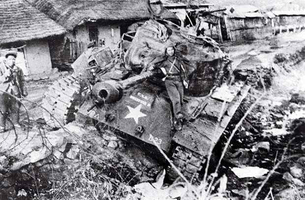
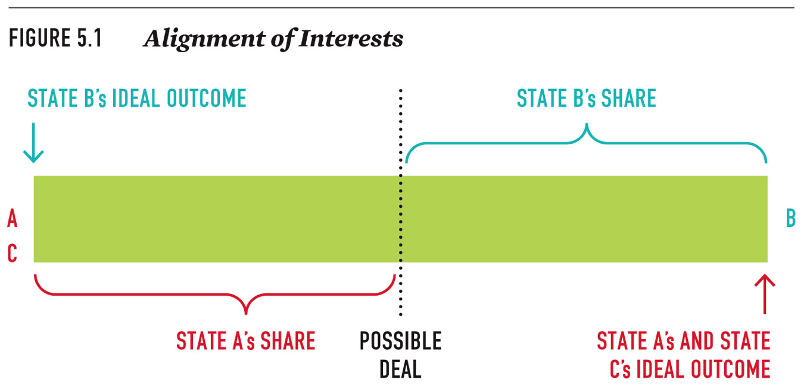
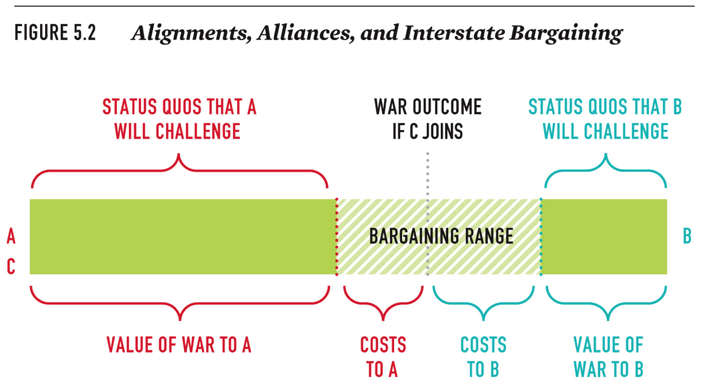
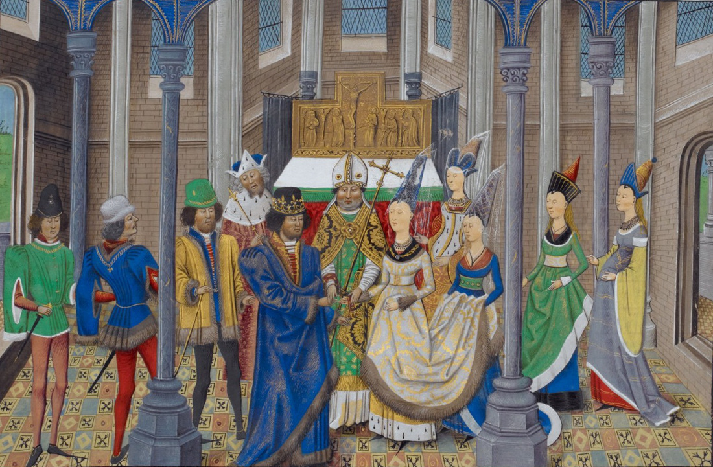
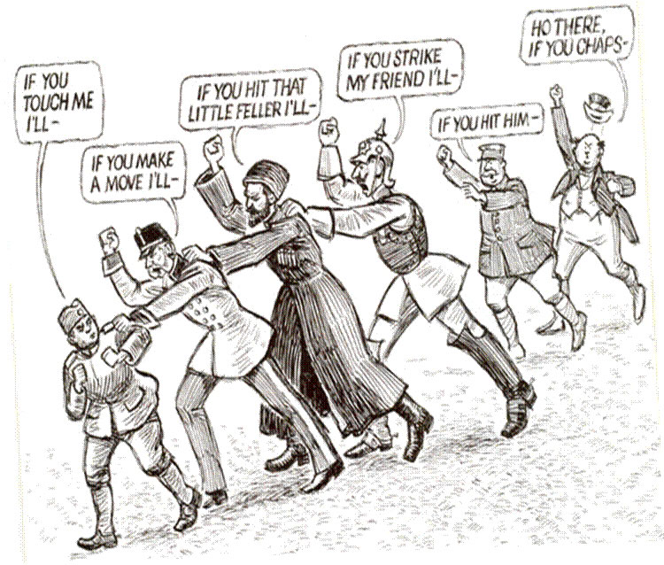

```{r setup, include=FALSE}
knitr::opts_chunk$set(cache=FALSE)

library(tidyverse)
library(lubridate)
library(stringr)
library(stevemisc)
library(scales)

```


# Introduction
### Puzzle(s) for Today

*Why do states fight other countries' wars?*

###



# Alliances and Conflict
###  Alliances

Alliances are commitments by states to cooperate on security policy.

- They form when states have compatible interests in military cooperation. 
- Importantly, alliances can alter the bargaining dynamics in a bilateral dispute.

### Types of Alliances

- Bilateral or multilateral (e.g. NATO)
- Asymmetrical—a powerful state commits to defending a weaker state (for example, the United States and South Korea)
- Offensive (e.g. Molotov-Ribbentrop)
- Defensive (e.g. France-Russia, pre-WWI)

### The Cost of Alliances

Alliances are costly. 
	
- Commitment of blood and treasure to defend another.
- Must be upheld to be credible, even if defeat is likely.
- Alliances limit freedom, as consultation with allies is necessary before taking action or making decisions. 
- An emboldened ally may entrap protector in conflict.

### Why Form Alliances?

- Weak state may gain protection from powerful rivals.
- Strong state may signal its resolve to defend weak state.
- Combining resources may economize, allowing greater defense.
- Can temper conflicts (e.g. Greece and Turkey in NATO).
- Can formalize a sphere of influence (e.g. the Warsaw Pact).

### Additional Motives

Balancing results in roughly equal blocs.
	
- Small states seek to avoid domination by alliance leader.
- Alliance with strong state threatens state freedom.

Other explanations of alliance formation

- Bandwagoning: when states join aggressive/threatening side (for example, Italy in World War II)
- Affinity: shared culture, ideology, or religion.

## Alliances and Bargaining
<!-- ###

 -->

###

```{r alignment-interests-ac-b, eval=T, echo=F, fig.height=8.5, fig.width=14, message=F, warning=F}
tibble(x = seq(-50, 50),
       y = seq(-50, 50)) %>%
  ggplot(.,aes(x,y)) + theme_steve_web() +
  theme(panel.grid.major = element_blank(), 
        panel.grid.minor = element_blank(),
        axis.ticks.x=element_blank(),
        axis.ticks.y=element_blank()) +
  scale_x_continuous(labels = NULL) +
  scale_y_continuous(labels = NULL, limits = c(-40, 40)) +
  xlab("") + ylab("") +
  annotate("rect", fill = "gray", alpha = 0.5, 
         xmin = -48, xmax = 48,
         ymin = -15, ymax = 15) +
  # bargaining range goes here -->
  annotate("rect", fill = "violet", alpha = 0.5, 
         xmin = -30, xmax = 30,
         ymin = -15, ymax = 15) + 
  annotate("text", x = 50, 
           y = 0, hjust=0.5, family="Open Sans",
           label = "B", fontface="bold", color="blue2", size=5) +
  annotate("text", x = -50, 
           y = 5, hjust=0.5, family="Open Sans",
           label = "A", fontface="bold", color="red2", size=5) +
  annotate("text", x = -50, 
           y = -5, hjust=0.5, family="Open Sans",
           label = "C", fontface="bold", color="red2", size=5) +
  annotate("text", x = -48, 
           y = 27.5, hjust=0, family="Open Sans",
           label = "State B's Ideal Outcome", 
           fontface="bold", color="blue2", size=5) +
  annotate("text", x = 48, 
           y = -30, hjust=1, family="Open Sans",
           label = "State A and C's\nIdeal Outcome", 
           fontface="bold",color="red2", size=5) +
  geom_segment(x=0, y=21, xend=0, yend=-21,
               color="black", linetype="dotted") +
  geom_segment(x = 48, y = -25, xend =48, yend = -18,
    arrow = arrow(length = unit(0.1, "inches")),
    color="red2") +
  geom_segment(x = -48, y = 25, xend = -48, yend = 18,
    arrow = arrow(length = unit(0.1, "inches")),
    color="blue2") +
  annotate("text", x=0, y=-26, hjust=0.5,
           family="Open Sans", label = "Potential\nDeal\n(i.e. the Outcome of War)",
           fontface="bold", size=5) +
  annotate("text", x = -15, y=-18, hjust=0.5,
           family="Open Sans", label = "<----- State A's Share ----->",
           fontface="bold", color="red2", size=5) +
  annotate("text", x = 15, y=18, hjust=0.5,
           family="Open Sans", label = "<----- State B's Share ----->",
           fontface="bold", color="blue2", size=5) +
  geom_segment(x= -30, y=-15, xend=-30, yend=15,
               color="black", linetype="solid") +
  geom_segment(x= 30, y=-15, xend= 30, yend=15,
               color="black", linetype="solid") +
    annotate("text", x=-40, y= 0,
           family="Open Sans", hjust="center",
           color="red2", label="A rejects\nthese deals", fontface="bold") +
  annotate("text", x=40, y= 0,
           family="Open Sans", hjust="center",
           color="blue2", label="B rejects\nthese deals", fontface="bold") +
  labs(title = "The Alignment of Interests Among A-C and B",
       subtitle = "C Supports A, but C's participation in a potential war is an open question. Both A and B are perfectly matched (i.e. p(victory) = .5) and a hypothetical bargaining space still exists.")
```


###

```{r alignment-interests-ac-b-range, eval=T, echo=F, fig.height=8.5, fig.width=14, message=F, warning=F}
tibble(x = seq(-50, 50),
       y = seq(-50, 50)) %>%
  ggplot(.,aes(x,y)) + theme_steve_web() +
  theme(panel.grid.major = element_blank(), 
        panel.grid.minor = element_blank(),
        axis.ticks.x=element_blank(),
        axis.ticks.y=element_blank()) +
  scale_x_continuous(labels = NULL) +
  scale_y_continuous(labels = NULL, limits = c(-40, 40)) +
  xlab("") + ylab("") +
  annotate("rect", fill = "gray", alpha = 0.5, 
         xmin = -48, xmax = 48,
         ymin = -15, ymax = 15) +
  # bargaining range goes here -->
  annotate("rect", fill = "violet", alpha = 0.5, 
         xmin = -10, xmax = 30,
         ymin = -15, ymax = 15) + 
  annotate("text", x = 50, 
           y = 0, hjust=0.5, family="Open Sans",
           label = "B", fontface="bold", color="blue2", size=5) +
  annotate("text", x = -50, 
           y = 5, hjust=0.5, family="Open Sans",
           label = "A", fontface="bold", color="red2", size=5) +
  annotate("text", x = -50, 
           y = -5, hjust=0.5, family="Open Sans",
           label = "C", fontface="bold", color="red2", size=5) +
  annotate("text", x = -48, 
           y = 27.5, hjust=0, family="Open Sans",
           label = "State B's Ideal Outcome", 
           fontface="bold", color="blue2", size=5) +
  annotate("text", x = 48, 
           y = -30, hjust=1, family="Open Sans",
           label = "State A and C's\nIdeal Outcome", 
           fontface="bold",color="red2", size=5) +
  # previous 50/50 deal, hypothetical --->
  geom_segment(x=0, y=21, xend=0, yend=-21,
               color="black", linetype="dotted") +
  # previous 50/50 deal, hypothetical --->
  geom_segment(x=10, y=21, xend=10, yend=-21,
               color="black", linetype="dotted") +
  geom_segment(x= -10, y=-15, xend=-10, yend=15,
               color="black", linetype="solid") +
  geom_segment(x= 30, y=-15, xend= 30, yend=15,
               color="black", linetype="solid") +
  geom_segment(x= -30, y=-15, xend= -30, yend=15,
               color="black", linetype="dashed") +
  geom_segment(x = 48, y = -25, xend =48, yend = -18,
    arrow = arrow(length = unit(0.1, "inches")),
    color="red2") +
  geom_segment(x = -48, y = 25, xend = -48, yend = 18,
    arrow = arrow(length = unit(0.1, "inches")),
    color="blue2") +
  annotate("text", x=0, y=-26, hjust=0.5,
           family="Open Sans", label = "War\nOutcome\n(Without C)",
           fontface="bold", size=5) +
  annotate("text", x=10, y=-26, hjust=0.5,
           family="Open Sans", label = "War\nOutcome\n(With C)",
           fontface="bold", size=5) +
  annotate("text", x=-40, y= 0,
           family="Open Sans", hjust="center",
           color="red2", label="A always rejects\nthese deals", fontface="bold") +
  annotate("text", x=40, y= 0,
           family="Open Sans", hjust="center",
           color="blue2", label="B rejects\nthese deals", fontface="bold") +
  annotate("text", x=-20, y= 0,
           family="Open Sans", hjust="center",
           color="red2", label="A rejects\nthese deals\nwhen C is assured\nto join the war\n(i.e. A accepts these deals\nwithout C's help)", fontface="bold") +
  geom_segment(x = 0.2, y = 0, xend =9.8, yend = 0,
    arrow = arrow(length = unit(0.1, "inches")),
    color="black") +
  labs(title = "What C's Participation Does to the Bargaining Range",
       subtitle = "C's participation decreases A's cost of war and decreases the bargaining range.")
```


<!-- ###

 -->

### How Alliances Establish Credibility

Alliance obligations are honored about 70% of the time. Reasons include:

- Hands-tying
- Abrogation costs
- Influencing decision-making calculus of opposing side in multiple ways

###



### When Alliances Fail

- The tail wags the dog, raising costs of war for *C*.
- Abrogation costs are cheap.

## Analyzing European Alliance System (1879-1990)
### 



### The Emergence of Germany

Germany emerged as a major power after 1870, collecting both friends and enemies.

- 1879: Dual Alliance with Austria-Hungary.
    - A curious alliance, given Seven Weeks' War (1866)
- 1882: Expansion to include Italy, Austria's blood enemy.
    - Italy's rationale: placate nearby states to focus on empire.
    
### The Counter-Coalition Against Germany

This prompted quite a counter-coalition, especially among former rivals.

- 1894: Franco-Russian Alliance
- 1904: Entente Cordiale (UK-France)
- 1907: Anglo-Russian Convention

### Leading to World War I

The alliance pattern contributed to the outbreak of World War I:

- Small conflicts escalated.
- Alliances created incentives for preventive war.
- Major powers became dependent on allies.
- The larger number of states increased chances of miscalculation.

### The Interwar Period

The interwar period posed similar problems.

- Major buck-passing, definitely among UK, France, and Russia/USSR.
- Hitler successfully defied French commitments to Czechoslovakia and Romania, among others.

### The Interwar Period

We can understand why the Molotov-Ribbentrop Pact happened in this perspective.

- No country was more consistent in raising alarms about Hitler than the USSR.
- However, UK and France had folded on the Ruhr, Sudetenland, and other issues.
- Thus, the Soviets bailed to placate Germany and leave UK and France to dry.

WWII happened as a result of weak alliance commitments.

### The Cold War

Clear bifurcation of Europe into West and East.

- West: NATO countries
- East: Warsaw Pact

### The Cold War

A long, if very problematic, "peace" followed.

- U.S. tied its hands to Europe with troops in W. Germany/elsewhere.
- Both sunk costs into reorganizing entire economic systems in the sphere.

# Conclusion
### Conclusion

Alliances are institutions that can prevent or facilitate war.

- Peaceful: influence bargaining by *B*, settle issues among signatories.
- Dangerous: tail-wags-the-dog, cheap commitments with small abrogation costs.
