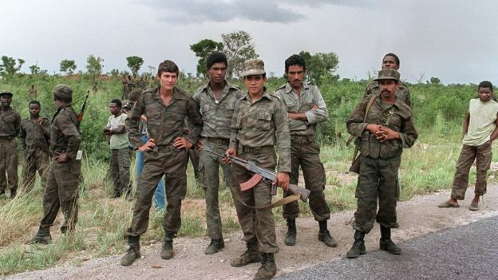

```{r setup, include=FALSE, cache=F, message=F, warning=F, results="hide"}
knitr::opts_chunk$set(cache=TRUE, warning=F)
knitr::opts_chunk$set(fig.path='figs/')
knitr::opts_chunk$set(cache.path='cache/')

knitr::opts_chunk$set(
                  fig.process = function(x) {
                      x2 = sub('-\\d+([.][a-z]+)$', '\\1', x)
                      if (file.rename(x, x2)) x2 else x
                      }
                  )
```


```{r loadstuff, include=FALSE}
knitr::opts_chunk$set(cache=FALSE)

library(tidyverse)
library(lubridate)
library(stringr)
library(stevemisc)
library(scales)
library(knitr)
library(WDI)
library(artyfarty)

# WRD <- read_csv("~/Dropbox/data/cow/religion/WRP_national.csv")
InterWars <- read_csv("~/Dropbox/data/cow/wars/Inter-StateWarData_v4.0.csv")
IntraWars <- read_csv("~/Dropbox/data/cow/wars/Intra-StateWarData_v4.1.csv") 

# 
# WRD %>%
#   filter(state == 660) %>%
#   select(year, islmgenpct, chrstgenpct) %>%
#   group_by(year) %>%
#   gather(category, value, 2:3) %>%
#   mutate(Group = ifelse(category == "islmgenpct", "Muslims", "Christians")) %>%
#   ggplot(.,aes(year, value, color=Group,linetype=Group)) +
#   geom_line(size=1.1) +
#   theme_steve_web2() +
#   scale_x_continuous(breaks = seq(1945, 2010, by=5)) +
#   scale_y_continuous(labels = scales::percent) +
#   xlab("Year") +
#   scale_color_manual(values = pal("google")) +
#   ylab("Percentage of National Population") +
#   annotate("rect", fill = "grey", alpha = 0.3,
#         xmin = 1975, xmax = 1990,
#         ymin = -Inf, ymax = Inf) +
#   annotate("text", x = 1982, y = .58, vjust=0.5,
#          label = "Lebanese\nCivil War\n(1975-1990)",
#          family = "Open Sans") +
#   labs(title = "The Christian Population in Lebanon Started to Decline as the Muslim Population Started to Rise",
#        subtitle = "Do note the data are five-year estimates in a tricky country in which population estimates were prone to measurement error. Treat as illustrative.",
#        caption = "Data: World Religion Data (v. 1.1)")
```


# Introduction
### Puzzle(s) for Today

*Civil war happens when a government and domestic non-state actor fail to peacefully bargain over differences. What explains when that happens?*

###



###

```{r intra-interstate-wars-1816-2007, echo=F, eval=T, message=F, error=F, warning=F, fig.width = 14, fig.height = 8.5}

InterWars %>% distinct(WarName, .keep_all=TRUE) %>%
  rowwise() %>%
  mutate(year = list(seq(StartYear1, EndYear1))) %>%
  ungroup() %>%
  unnest() %>%
  arrange(WarName, year) %>%
  select(WarName, year) %>%
  distinct(WarName, year) %>%
  group_by(year) %>%
  summarize(numinterwars = n()) -> numinterwars

IntraWars %>% distinct(WarName, .keep_all=TRUE) %>%
  rowwise() %>%
  filter(!is.na(EndYear1)) %>%
  filter(EndYear1 >= 1816) %>%
  mutate(year = list(seq(StartYear1, EndYear1))) %>%
  ungroup() %>%
  unnest() %>%
  arrange(WarName, year) %>%
  select(WarName, year) %>%
  distinct(WarName, year) %>%
  group_by(year) %>%
  summarize(numintrawars = n()) -> numintrawars

numintrawars %>%
  left_join(.,numinterwars) %>%
  mutate(numinterwars = ifelse(is.na(numinterwars), 0, numinterwars)) %>%
  ggplot(.,aes(year, numintrawars)) + theme_steve_web() +
  geom_ribbon(aes(ymin=0, ymax=numintrawars),
              alpha=0.6, fill="#F8766D") +
  geom_line(aes(y=numintrawars), color = "#F8766D", size = 1, linetype="dashed") +
  geom_ribbon(aes(ymin=0, ymax=numinterwars),
              alpha=0.9, fill="#00BFC4") +
  geom_line(aes(y=numinterwars), color = "#00BFC4",  size = 1.5) +
  scale_x_continuous(breaks=seq(1820, 2010, by=10)) +
  ylab("Number of Wars") + xlab("Year") +
  ggtitle("Intra-state Wars Are the Typical Case of War These Days") +
  labs(subtitle="Intra-state wars (red-dashed line) increase in number after World War II and peak with the end of the Cold War",
       caption="Data: Correlates of War War Data (v. 4.1). Temporal Domain: 1816-2007.")

```


###

```{r colombia-civil-conflict-deaths-1989-2017, echo=F, eval=T, message=F, error=F, warning=F, fig.width = 14, fig.height = 8.5}

UCDP <- WDI(country="all", indicator=c("VC.BTL.DETH"), start=1946, end=2017) %>%
  rename(btldeath = VC.BTL.DETH, Country = country)

UCDP %>%
  filter(Country == "Colombia") %>%
  filter(year > 1988) %>%
  mutate(# btldeath = ifelse(Country == "Colombia" & year == 2017, 0, btldeath),
         lab = prettyNum(btldeath, big.mark=",")) %>% 
  ggplot(., aes(year, btldeath, fill=Country)) +  theme_steve_web() +
  geom_bar(stat="identity", position="dodge", alpha = .8,  color="black") +
  scale_fill_manual(values = pal("five38")) +
  geom_text(aes(label=lab), vjust=-.5, colour="black",
            position=position_dodge(.9), size=3.5, family = "Open Sans") +
  geom_hline(yintercept=1000, color="black", linetype = "dashed",  alpha=0.3) +
  # geom_bar(stat="identity", alpha = .8, fill="#F8766D", color="black") +
  xlab("Year") + ylab("Battle-related Deaths") +
  scale_x_continuous(breaks = seq(1988, 2016, by = 2)) +
  scale_y_continuous(labels = scales::comma) +
  ggtitle("Battle-related Deaths in Colombia's Civil Conflict (1989-2016)") +
  # geom_text(aes(label=btldeath), color="black",
  #           position=position_dodge(width=.9), 
  #           size=3.75, vjust = -.3, family="Open Sans") +
  annotate("text", x=2016, y=1050, 
           label= "Conventional cutoff for operationalizing civil war", hjust=1, family = "Open Sans") +
  labs(subtitle="Civil conflicts tend to be protracted and fluctuate in severity, like the conflict in Colombia that has been ongoing since 1964.",
       caption="Data: UCDP, via World Bank.") +
    theme(legend.position ="none")
```

###

```{r myanmar-civil-conflict-deaths-1989-2017, echo=F, eval=T, message=F, error=F, warning=F, fig.width = 14, fig.height = 8.5}


UCDP %>%
  filter(Country == "Myanmar") %>%
  filter(year > 1988) %>%
  mutate(# btldeath = ifelse(Country == "Colombia" & year == 2017, 0, btldeath),
         lab = prettyNum(btldeath, big.mark=",")) %>% 
  ggplot(., aes(year, btldeath, fill=Country)) +  theme_steve_web() +
  geom_bar(stat="identity", position="dodge", alpha = .8,  color="black") +
  scale_fill_manual(values = pal("ft")) +
  geom_text(aes(label=lab), vjust=-.5, colour="black",
            position=position_dodge(.9), size=3.5, family = "Open Sans") +
  geom_hline(yintercept=1000, color="black", linetype = "dashed",  alpha=0.3) +
  xlab("Year") + ylab("Battle-related Deaths") +
  scale_x_continuous(breaks = seq(1988, 2016, by = 2)) +
  scale_y_continuous(labels = scales::comma) +
  ggtitle("Battle-related Deaths in Myanmar's Civil Conflicts (1989-2017)") +
  annotate("text", x=2016, y=1050, 
           label= "Conventional cutoff for operationalizing civil war", hjust=1, family = "Open Sans") +
  labs(subtitle="Severity varies, but Myanmar has been in a near constant series of ethnic conflicts, prominently with the Karens, since independence from the UK in 1948.",
       caption="Data: UCDP, via World Bank.") +
    theme(legend.position ="none")
```

# Civil Wars
## A Typology of Civil War
### Why Study Civil War?

- Theoretical tools apply from international to domestic context.
- Civil wars rarely stay domestic.
    - Other countries intervene/take sides
    - Spillover effects
    
### Why Rebel?

A quick typology:

- Greed vs. grievance
- Control of central government vs. secession
    - Separatist: non-state actor seeks to secede/form own country (e.g. Eritrea, South Sudan)
    - Irredentist: non-state actor seeks to secede/join another country (e.g. Donbass, Srpska)

## The Correlates of Civil War Onset
### When Dissatisfaction Leads to Armed Opposition

- Group-level explanation
- Country-level explanation 
- International factors

### Group-level Explanations

Groups better organize for rebellion when they can coordinate. What helps toward that end: 

- Groups share ethnic, religious, or linguistic affinity (e.g. Sunni insurgency).
- Have access to resources to garner support (e.g. FARC).
- Share a sense of injustice directed at government.

### Country-level Factors

There are several important country correlates for civil war.

- Poverty
- Non-democracy
    - Importantly, there may be more violence "in the middle."
- Rugged terrain
- Bigger population


### International Factors

- Foreign states may arm or aid rebels they support (see: Serbia)
- Sanctions against target government may embolden rebels (e.g. U.S. v. Nicaragua)

One wrinkle: international rivalries over territory may reduce likelihood of civil war onset.

## Civil War as Bargaining Failure

### Not All Disagreements Militarize

Not all conflicts between dissatisfied groups and the government result in civil war.

- Compare Tunisia (2011) with Syria (2011-present).

We can instead understand civil war onset as bargaining failure.

### Civil War as Bargaining Failure

We study civil war in IR because the bargaining framework applies well.

- Incomplete information
- Commitment problems
- Issue Indivisibility

### Civil War from Incomplete Information

Governments have a particular disadvantage gauging would-be rebels:

- Less scope for communication during bargaining phase
- Tough to gauge rebel capacity

### Civil War from Incomplete Information


However, the protracted nature of civil conflicts don't fit well with arguments of incomplete information.

- That said, nature of civil war (i.e. insurgency, asymmetric warfare) magnify the information problem for central governments.

###

```{r intra-inter-state-war-lengths, echo=F, eval=T, message=F, error=F, warning=F, fig.width = 14, fig.height = 8.5}

InterWars %>%
  distinct(WarNum, .keep_all=T) %>%
  mutate(sdate = lubridate::ymd(paste(StartYear1, StartMonth1, StartDay1)),
         edate = lubridate::ymd(paste(EndYear1, EndMonth1, EndDay1))) %>%
  select(WarNum, sdate, edate) %>%
  mutate(duration = as.numeric(difftime(edate,
                                      sdate, 
                                      units="days") + 1)) %>%
  mutate(category=cut(duration, breaks=c(-Inf, 30, 60, 120, 365, 730, 1095, Inf), 
                       labels=c("1-30\ndays","31-60\ndays", "61-120\ndays",
                                "121-365\ndays",
                                "1-2 years", "2-3 years", "Longer than\n3 years"))) %>%
  group_by(category) %>%
  summarize(n = n()) %>%
  ungroup() %>%
  mutate(perc = n/sum(n)) %>%
  mutate(Type = "Inter-State Wars") -> InterWars_durations
  
IntraWars %>%
  distinct(WarNum, .keep_all=T) %>%
  mutate(sdate = lubridate::ymd(paste(StartYear1, StartMonth1, StartDay1)),
         edate = lubridate::ymd(paste(EndYear1, EndMonth1, EndDay1))) %>%
  select(WarNum, sdate, edate) %>%
  mutate(duration = as.numeric(difftime(edate,
                                      sdate, 
                                      units="days") + 1)) %>%
  mutate(category=cut(duration, breaks=c(-Inf, 30, 60, 120, 365, 730, 1095, Inf), 
                       labels=c("1-30\ndays","31-60\ndays", "61-120\ndays",
                                "121-365\ndays",
                                "1-2 years", "2-3 years", "Longer than\n3 years")))  %>%
  group_by(category) %>%
  summarize(n = n()) %>%
  filter(!is.na(category)) %>%
  ungroup() %>%
  mutate(perc = n/sum(n)) %>%
  mutate(Type = "Intra-State Wars")  -> IntraWars_durations


bind_rows(InterWars_durations, IntraWars_durations) %>%
  mutate(lab = paste0(mround2(perc),"%")) %>%
  ggplot(.,aes(category, perc, fill=Type)) + theme_steve_web() +
  geom_bar(stat="identity", position = "dodge", 
           alpha = I(0.8),color = I("black")) +
  xlab("Duration Category") + ylab("Percentage of Total Wars (by Type)") +
  scale_y_continuous(labels = scales::percent) +
  geom_text(aes(label=lab), vjust=-.5, colour="black",
            position=position_dodge(.9), size=3.7, family = "Open Sans") +
  scale_fill_manual(values = pal("five38")) +
  labs(title = "The Typical War—Intra-State or Inter-State—is Going to Last 365 Days or Fewer",
       subtitle = "...and yet plenty wars last several years, even as multi-year intra-state wars are more common than multi-year inter-state wars.",
       caption = "Data: Correlates of War.")


```

### Civil War from Commitment Problem

- Very real incentives for preventative war
- Problems of post-war reconciliation
- Rebels cannot credibly promise compliance from radicals.

From this perspective, it's unsurprising that only about 25% of all civil wars end in a negotiated peace.

- Lasting peaces tend to follow outright victory.

### Civil War from Issue Indivisibility

Demands also suffer from the 0/1 problem of issue indivisbility.

- Territorial concession creates major reputation problems in multiethnic states.
- Consociationalism/power-sharing only partially mollifies concerns over control of central government.
    - Even these have commitment problems (e.g. Lebanon).

# Conclusion: What Can We Do?
### Conclusion: What Can We Do?

If peace prevails through conquest, governments need counterinsurgency strategies.

- Conventional military forces are not always very effective against insurgencies. 
- Often, conventional armies inflict collateral damage by killing women, children, and noncombatants.
    - This creates future rebels.
    
### Conclusion: What Can We Do?

    
Any lasting peace needs to win over "hearts and minds."

- Must build goodwill among population that previously rebeled.
- Need to integrate previous rebels into society/state.
- Economic development and democracy are almost musts.
    - But therein lies a major part of the problem.
