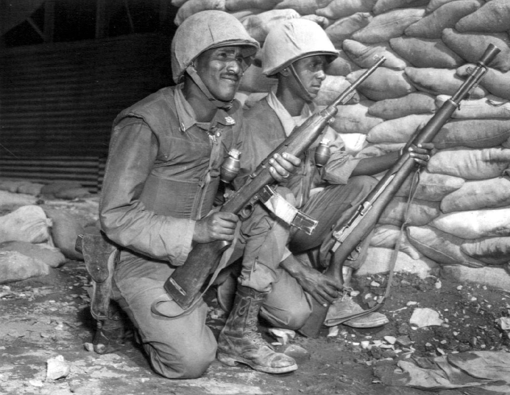

```{r setup, include=FALSE, cache=F, message=F, warning=F, results="hide"}
knitr::opts_chunk$set(cache=TRUE, warning=F)
knitr::opts_chunk$set(fig.path='figs/')
knitr::opts_chunk$set(cache.path='cache/')

knitr::opts_chunk$set(
                  fig.process = function(x) {
                      x2 = sub('-\\d+([.][a-z]+)$', '\\1', x)
                      if (file.rename(x, x2)) x2 else x
                      }
                  )
options(knitr.kable.NA = '')
```

```{r loadstuff, include=FALSE}
knitr::opts_chunk$set(cache=FALSE)

library(tidyverse)
library(lubridate)
library(stringr)
library(stevemisc)
library(scales)
library(knitr)

```


# Introduction
### Puzzle(s) for Today

*War creates costs and negative externalities, so why doesn't the international community stop it?*

###



# Collective Security
### Collective Security Organizations

Alliance strengthen commitments to allies and signal resolve to potential rivals.

- By contrast, collective security organizations like the UN form around a common interest that all states are presumed to share.

The challenge is to achieve collective action to deter, end, and prevent recurrence of interstate and civil wars.

### Collective Security

Collective security is a public good.

- Members pledge to aid any state that is victim of aggression.
- An attack on one is an attack against all.

Credible commitments increase the cost of belligerency.

### The United Nations

The UN is the most prominent collective security organization.

- Founded as post-war concert, akin to Congress of Vienna.
- Chartered at the UNCIO conference in San Francisco.

Charter VII (Articles 39-51) are the money passages.

- Outline scope of UN Security Council interventions.
- Invoked only twice: Korea (1950), Iraq (1991)

### Regional Security Organizations

Organization of American States (OAS)

- A "new" post-WWII organization from an old idea (see: Simón Bolívar, ICAS).
- No armed interventions, but several disciplinary measures:
    - Suspension of Cuba, 1962-2009
    - Suspension of Honduras, 2009-2011
    - Sanctions against Dominican Republic, 1960
    
Arab League

- Politically difficult to coordinate a military force
- Recent peace-keeping operations to South Lebanon, Darfur, Iraq, Somalia

### African Union

The AU is an important IGO that doesn't get enough praise.

- Major mission: "promote peace, security, and stability on the continent"
- Important interventions for constitutionality in Mali, Mauritania, and Togo.
- Military interventions in Comoros, Somalia, and Sudan

### The Problem of Collective Security

Public goods often are undersupplied because of the free-rider problem.

- More likely to target weak states than strong states.
- Members seek to avoid costliest conflicts.

It's often hard to identify aggressor in conflict.

- Most powerful allies may seek to defend belligerent allies instead of protecting world order

# The United Nations in Focus
### The UN in Focus

- Institutional structure
- Power on the Security Council
- Types of enforcement
- Peacekeeping
- Success stories
- Complications

### The UN's Structure


- General Assembly
    - All members represented.
- Vote on budgets for specialized agencies
- Security Council: 15 states
    - Powerful states have more sway.
    - Permanent five (P5) have veto power.
    - Ten rotating members, two-year terms.
    - Council decides if aggression has occurred and how to respond.
    - Decisions are binding on all members of the UN.

### The P5 and the Security Council

- Powers granted to Security Council to try to have most powerful states agree.
- Each permanent member (China, France, Great Britain, Russia, and the United States) has a veto.
    - There's a reason the P5 is the P5 given UN's history.
- The P5 have more power, so this biases decisions in a way that is consistent with their interests.
- The extraordinary influence of the P5 increases credibility of Security Council action by communicating that powerful states agree and will back such action.
    - It's what makes UN sanctions more credible.
    
### Types of Enforcement

- Authorize use of force against aggressor.
- Send peacekeepers to act as a buffer between belligerents (for example, the Korean and Gulf wars).
- Sanctions

### Peacekeeping

- Requires consent of combatants.
- Seeks to resolve commitment problems by providing impartial monitors.
- Can help with tasks such as elections

### The UN Success Stories

UN peacekeeping missions have successfully resolved conflicts in El Salvador, Guatemala, Mozambique, and Cambodia. Tasks include:

- Disarming rebel groups 
- Integrating rebels into armed forces
- Organizing and holding elections
- Building civil society

### Complications

The UN has been less effective in cases in which the P5 do not agree and in which the host government does not welcome them.

- See: Syria, now.

Sometimes there's no government in which to negotiate entry.

- See: Somalia, 1992

###

```{r un-pko-total-1948-2014, echo=F, eval=T, message=F, error=F, warning=F, fig.width = 14, fig.height = 8.5}

UNPKO <- read_csv("number-of-united-nations-peacekeeping-operations-around-the-world-1948-2014.csv")

UNPKO %>%
  ggplot(.,aes(Year, `Number of peacekeeping missions`)) +
  geom_line(size=1.1) + theme_steve_web() +
  geom_ribbon(aes(ymin=0, ymax=`Number of peacekeeping missions`),
              alpha=0.3, fill="blue") +
  ggtitle("Number of United Nations Peacekeeping Operations Around the World, 1948-2014") +
  scale_x_continuous(breaks=seq(1945, 2015, 5)) +
  labs(caption="Source: United Nations Peackeeping via OurWorldInData.org/peacekeeping/",
       subtitle = "The explosion of civil wars in the 1990s largely explains the rise in UN PKOs.")
  

```

###

```{r un-pko-size-1947-2014, echo=F, eval=T, message=F, error=F, warning=F, fig.width = 14, fig.height = 8.5}

UNPKS <- read_csv("total-size-of-united-nations-peacekeeping-forces-around-the-world-1947-2014.csv")

UNPKS %>%
  ggplot(.,aes(Year, `Size of total peacekeeping force`)) + geom_line(size=1.1) + 
  theme_steve_web() +
  ggtitle("Total Size of United Nations Peacekeeping Forces, 1947-2014") +
  scale_x_continuous(breaks=seq(1945, 2015, 5)) +
  scale_y_continuous(labels = scales::comma) +
  geom_ribbon(aes(ymin=0, ymax=`Size of total peacekeeping force`),
              alpha=0.3, fill="blue") +
  labs(caption="Source: United Nations Peackeeping via OurWorldInData.org/peacekeeping/",
       subtitle = "The discrepancy between 1994-1997 follows the end of several African PKOs in 1994 (e.g. Mozambique, Uganda-Rwanda) and the emergence of new ones in the Balkans.")
  

```

###

```{r top-ten-contributors-unpkos-2016, eval=T, echo=F, message=F, warning=F, fig.width = 14, fig.height = 8.5}

UNPKCS <- read_csv("~/Dropbox/teaching/posc1020/collective-security/data_tcc.csv")

UNPKCS %>%
  mutate(Year = year(Date)) %>%
  group_by(Year, Contributor) %>%
  summarize(meantc = mean(`Troop Contributions`, na.rm=T)) %>%
  filter(Year == 2016) %>% arrange(-meantc) %>%
  rename(`Average Troop Contributions` = meantc) %>% head(10) %>%
  mutate(lab = prettyNum(round(`Average Troop Contributions`, 0),big.mark=",")) %>%
  ggplot(.,aes(reorder(Contributor, -`Average Troop Contributions`), `Average Troop Contributions`)) + 
  theme_steve_web() +
  geom_bar(stat="identity", alpha=0.8, fill="#619cff", color="black") +
  xlab("Country") +
  geom_text(aes(label=lab), vjust=-.5, colour="black",
            position=position_dodge(.9), size=4) +
  scale_y_continuous(labels = scales::comma) +
  labs(title = "Top Ten Country Contributors to UN Peacekeeping Forces, 2016",
       subtitle = "Ethiopia led all countries in 2016 with an average of 8,177 troops serving in UN Peacekeeping operations.",
       caption = "Source: IPI Peacekeeping Database. Means rounded to full integers for convenience.")

```

### 

```{r top-ten-contributors-unpkos-proportion-2015, eval=T, echo=F, message=F, warning=F,  fig.width = 14, fig.height = 8.5}

MB15 <- read_csv("~/Dropbox/data/military-balance/2015/mb2015.csv")

UNPKCS %>%
  mutate(Year = year(Date)) %>%
  group_by(Year, Contributor) %>%
  summarize(meantc = mean(`Troop Contributions`, na.rm=T)) %>%
  filter(Year == 2015) %>%
  left_join(., MB15, by=c("Contributor" = "country")) %>%
  mutate(meantcperc = round((meantc/active)*100, 2)) %>%
  arrange(-meantcperc) %>%
  select(Year, Contributor, meantcperc) %>%
  head(10) %>%
  mutate(lab = paste0(round(meantcperc, 2),"%"),
         meantcperc = meantcperc/100) %>%
  ggplot(.,aes(reorder(Contributor, -meantcperc), meantcperc)) + 
  theme_steve_web() +
  geom_bar(stat="identity", alpha=0.8, fill="#619cff", color="black") +
  xlab("Country") +
  geom_text(aes(label=lab), vjust=-.5, colour="black",
            position=position_dodge(.9), size=4) +
  scale_y_continuous(labels = scales::percent) +
  labs(title = "Top Ten Contributors to UN Peacekeeping Forces as % of Active Personnel, 2015",
       subtitle = "Over 34% of Niger's active personnel served in UN PKOs in 2015 and nine of 10 countries in this list are in Sub-Saharan Africa.",
       caption = "Source: IPI Peacekeeping Database, Military Balance.")

```

# Conclusion
### Conclusion

The world is better off for collective security organizations, but problems persist.

- Most successful when you can get strong states to agree (or at least not veto).
- Least successful when targeting interests of strong states (e.g. Israel, Syria).