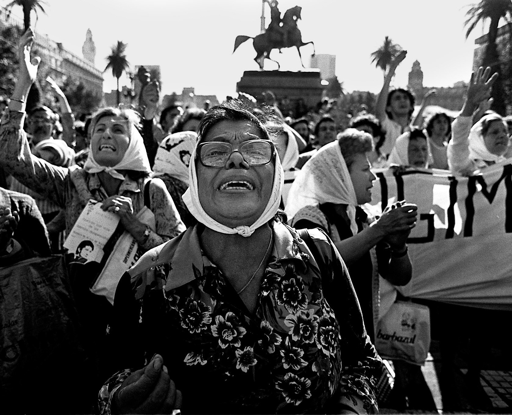
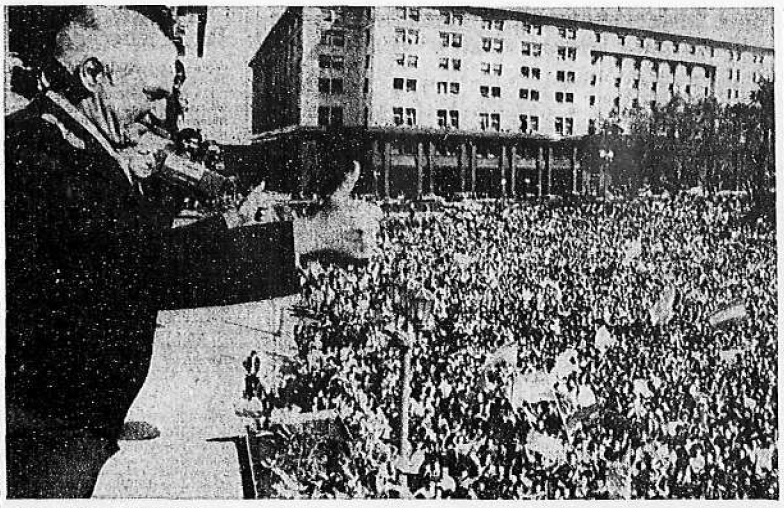

```{r setup, include=FALSE, cache=F, message=F, warning=F, results="hide"}
knitr::opts_chunk$set(cache=TRUE)
knitr::opts_chunk$set(fig.path='figs/')
knitr::opts_chunk$set(cache.path='cache/')

knitr::opts_chunk$set(
                  fig.process = function(x) {
                      x2 = sub('-\\d+([.][a-z]+)$', '\\1', x)
                      if (file.rename(x, x2)) x2 else x
                      }
                  )
```

```{r loadstuff, include=FALSE}

library(tidyverse)
library(lubridate)
library(stringr)
library(stevemisc)
library(scales)
library(artyfarty)
library(ggrepel)
library(fredr)
library(lubridate)

Polity <- readxl::read_xls("~/Dropbox/data/polity/p4v2016.xls")
# Support <- read_csv("~/Dropbox/teaching/posc1020/domestic-politics-1/war-support-casualties-graph.csv")
Support <- read_csv("https://gist.githubusercontent.com/svmiller/401b9f8c8afdd9e8535533e42e0d7213/raw/1beb26069c1464c62923d396128bdf2e1e88b74c/american-conflict-support-casualties.csv")
ApprovalM <- read_csv("~/Dropbox/data/potus-approval/potus-approval-monthly-average.csv")

```


# Introduction
### Puzzle(s) for Today

*It's usually more rational to bargain than go to war, but is that true for "everyone" or just "states?"*

###


###


###


### War With Complete and Perfect Information

War generally never happens with complete and perfect information, except for:

1. Issue indivisibility
2. Asymmetric/incomplete information (i.e. uncertainty)
3. Commitment problems

### Plaza de Mayo (Argentina), March 30, 1982



### Plaza de Mayo (Argentina), April 2, 1982



# Domestic Politics and War
## Whose Interests Count?
### Domestic Politics and War

- Interests
- Leaders
- Groups

<!-- Interests may be national or particularistic. National security would be a national interest. Trade protection would be particularistic to the protected sector. Leaders and groups may have interests in war. -->

###

```{r price-oil, fig.height=8.5, fig.width = 14, echo=F, eval = T, message =F, warning = F}

Price <- fredr(series_id = "CPIAUCSL",
                      observation_start = as.Date("1947-01-01")) %>%
  rename(CPIAUCSL = value) %>% select(-series_id)

fredr(series_id = "WTISPLC",
             observation_start = as.Date("1947-01-01")) %>%
  rename(WTISPLC = value) %>% select(-series_id) %>%
  left_join(., Price) %>% na.omit %>%
  mutate(last = last(CPIAUCSL),
         index = (CPIAUCSL/last)*100,
    real = (WTISPLC/index)*100) -> priceoil

lastmonth <- as.character(last(month(priceoil$date, label=T, abbr=F)))
ylabc <- paste0("Inflation Adjusted Price, in ", lastmonth, " 2018 USD Dollars")
  
priceoil %>%
  ggplot(.,aes(date, real, group=1)) + geom_line() + theme_steve_web() +
  scale_x_date(date_breaks = "5 years",
               breaks = seq(1950, 2016, by = 2),
               date_labels = "%Y") +
  geom_ribbon(aes(ymin=0, ymax=real),
              alpha=0.3, fill="blue") + xlab("") +
  ylab(ylabc) +
  annotate("text", x = as.Date("1973-07-01"), y = 75, 
           label = "Arab oil embargo,\nYom-Kippur War\n(1973)",
           family="Open Sans") +
 annotate("text", x = as.Date("1980-01-01"), y =135, 
          label = "Iranian revolution,\nIran-Iraq War\n(1979/80)",
          family = "Open Sans") +
  annotate("text", x = as.Date("2005-01-01"), y = 150, 
           label = "Energy crisis,\nrecession\n(2007/8)",
           family = "Open Sans") +
  annotate("text", x = as.Date("2013-01-01"), y = 130, 
           label = "Arab Spring\n(2011)",
           family = "Open Sans") +
  labs(title = "Average Crude Oil Price, 1947-2018",
       subtitle = "We observe prominent spikes that coincide with the Arab oil embargo, Iran-Iraq War onset, and the worst consequences of the Iraq War and corollary financial crisis.",
       caption = "Data:  Federal Reserve Bank of St. Louis. 
       Note: prices are for West Texas Intermediate (WTI), manually converted from nominal to real prices with the consumer price index for urban consumers for all items. Open to suggestions of better price indices.")

```


###

```{r price-oil-potus, fig.height=8.5, fig.width = 14, echo=F, eval = T, message =F, warning = F}

Price <- fredr(series_id = "CPIAUCSL",
                      observation_start = as.Date("1947-01-01")) %>%
  rename(CPIAUCSL = value) %>% select(-series_id)


fredr(series_id = "WTISPLC",
             observation_start = as.Date("1947-01-01")) %>%
  rename(WTISPLC = value) %>% select(-series_id) %>%
  left_join(., Price) %>% na.omit %>%
  mutate(last = last(CPIAUCSL),
         index = (CPIAUCSL/last)*100,
         real = (WTISPLC/index)*100) -> oil

oil %>%
  mutate(starty = year(date),
         startm = month(date)) %>%
  group_by(starty, startm) %>%
  summarize(real = mean(real)) %>%
  left_join(ApprovalM, .) -> dat

dat %>% ungroup() %>%
  mutate(pricediff = real - dplyr::lag(real)) -> dat

dat %>%
  filter(potus == "George W. Bush") %>%
  ggplot(.,aes(real, netapprove)) +
  theme_steve_web() +
  geom_point() + 
  geom_smooth() +
  xlab("Price of Oil (WTI, Inflation-Adjusted to Current USD)") + ylab("Net Presidential Approval Rating") +
  labs(title = "Few Presidents Exemplify a Negative Relationship Between Gas Prices and Presidential Approval as George W. Bush",
       subtitle = "Bush's approval rating sank amid a slew of problems, especially the energy crisis.",
       caption = "Data: Federal Reserve Bank of St. Louis, American Presidency Project.")

#%>% data.frame %>%
#  data.frame(Date = rownames(.), .) %>% 
#  mutate(Date = as.Date(Date)) %>% tbl_df()
```  


### Leaders and War

Do leaders ever spark war to keep power at home?

- Evidence is mixed, but we've seen it before.

How does the "rally around the flag" effect alter the bargaining range?

- A rally incentive increases the value of one side for war, decreasing size of bargaining range.

<!-- ### 

 -->

<!--

Rally Effects and the Bargaining Range


Rally effect: A short-term boost in government approval from a foreign policy crisis.
Both democratic and nondemocratic leaders may seek the rally effect:
	- 	rally for reelection
	- 	rally to reestablish legitimacy if nondemocratic

-->

### What Can We Say About "Rallies?"

The Falklands War is the classic case of the diversion and the rally.

- Diversion applies to domestic troubles for both sides.
- Rally applies to both sides as well.

However, general evidence in support of rallies and diversions are mixed.

- Generally, secure leaders are more likely to start a crisis.
- Most of our evidence is anecdotal.

###

```{r american-public-support-conflict-casualties, fig.height=8.5, fig.width = 14, echo=F, eval = T, message =F, warning = F}

Support %>%
  mutate(Support = Support/100) %>%
  ggplot(.,aes(Casualties, Support, color=War)) + 
  geom_line(size = 1.1) + 
  scale_x_log10(breaks = 10^seq(0,5), labels=scales::comma) + 
  scale_y_continuous(labels=scales::percent, limits =c(0,1)) +
  theme_steve_web() +
  # geom_label_repel(aes(Casualties, Support, label = War)) 
  scale_color_manual(values = pal("d3js")) +
  geom_hline(yintercept = .5, linetype = "dotted", color="grey33") +
  annotate("text", x=1, y = .84, 
           label = "Panama",  family="Open Sans") +
  annotate("text", x=40, y = .25, 
           label = "Somalia", family="Open Sans") +
  annotate("text", x=375, y = .4, 
           label = "Lebanon",  family="Open Sans") +
  annotate("text", x=40, y = .95, 
           label = "Afghanistan",  family="Open Sans") +
  annotate("text", x=3000, y = .32, 
           label = "Iraq", family="Open Sans") +
  annotate("text", x=60000, y = .35, 
           label = "Vietnam",  family="Open Sans") +
  annotate("text", x=8000, y = .6, 
           label = "Korea",  family="Open Sans") +
  annotate("text", x=4000, y = .89, 
           label = "WWII",  family="Open Sans") +
  labs(title = "The American Public's Support for Conflict Generally Wanes as American Casualties Mount",
       subtitle = "'Support' is variously defined, contingent on the particular survey question, so the trends should be read as more illustrative.",
       caption = "Data: Larson (1996) for WWII-Somalia. Gallup/iCasualties.org for Afghanistan and Iraq.") +theme(legend.position="none")
```

###

```{r war-fate-leaders, fig.height=8.5, fig.width = 14, echo=F, eval = T, message =F, warning = F}

tribble(
  ~Type, ~`War Outcome`, ~`Leader Fate`, ~Count,
  "Democracy", "Victory", "Stayed in Power", 20,
  "Democracy", "Victory", "Out of Power", 9,
  "Democracy", "Victory", "Punished", 1,
  "Democracy", "Small Loss", "Stayed in Power", 1,
  "Democracy", "Small Loss", "Out of Power", 6,
  "Democracy", "Small Loss", "Punished", 2,
  "Democracy", "Big Loss", "Stayed in Power", 0,
  "Democracy", "Big Loss", "Out of Power", 1,
  "Democracy", "Big Loss", "Punished", 1,
  "Mixed Regime", "Victory", "Stayed in Power", 23,
  "Mixed Regime", "Victory", "Out of Power", 8,
  "Mixed Regime", "Victory", "Punished", 3,
  "Mixed Regime", "Small Loss", "Stayed in Power", 13,
  "Mixed Regime", "Small Loss", "Out of Power", 11,
  "Mixed Regime", "Small Loss", "Punished", 11,
  "Mixed Regime", "Big Loss", "Stayed in Power", 1,
  "Mixed Regime", "Big Loss", "Out of Power", 9,
  "Mixed Regime", "Big Loss", "Punished", 9,
  "Dictatorship", "Victory", "Stayed in Power", 34,
  "Dictatorship", "Victory", "Out of Power", 5,
  "Dictatorship", "Victory", "Punished", 2,
  "Dictatorship", "Small Loss", "Stayed in Power", 31,
  "Dictatorship", "Small Loss", "Out of Power", 18,
  "Dictatorship", "Small Loss", "Punished", 15,
  "Dictatorship", "Big Loss", "Stayed in Power", 2,
  "Dictatorship", "Big Loss", "Out of Power", 6,
  "Dictatorship", "Big Loss", "Punished", 6
) -> goemans2011tab32 # p. 58

goemans2011tab32 %>%
  filter(`Leader Fate` != "Punished") %>%
  group_by(`War Outcome`) %>%
  mutate(tot = sum(Count)) %>%
  group_by(`War Outcome`, `Leader Fate`) %>%
  summarize(perc = sum(Count)/unique(tot)) %>%
  mutate(lab = paste0(round(perc*100, 1), "%")) %>%
  ggplot(.,aes(`War Outcome`, perc, fill=`Leader Fate`)) +
  theme_steve_web() +
  geom_bar(stat="identity", position = "dodge",
           alpha = I(0.8),color = I("black")) +
    geom_text(aes(label=lab), vjust=-.5, colour="black",
            position=position_dodge(.9), size=4) +
  ylab("Percentage") +
  scale_fill_manual(values = pal("five38")) +
  scale_y_continuous(labels = scales::percent, limits = c(0,1)) +
  labs(title = "War and the Fate of Leaders",
       subtitle = "Leaders are more (less) likely to be replaced from office following defeat (victory) in war.",
       caption = "Source: Goemans, Hein. 2000. ''War and Punishment : The Causes of War Termination and the First World War''. Princeton, NJ: Princeton University Press. [Table 3.2, p. 58]")
```

###

```{r war-fate-leaders-democracy, fig.height=8.5, fig.width = 14, echo=F, eval = T, message =F, warning = F}
goemans2011tab32 %>%
  filter(`Leader Fate` != "Punished") %>%
  mutate(Type = ifelse(Type == "Democracy", "Democracy", "Non-Democracy"),
         `War Outcome` = ifelse(`War Outcome` == "Victory", "Victory", "Loss")) %>%
  group_by(Type, `War Outcome`) %>%
  mutate(tot = sum(Count)) %>%
  group_by(Type, `War Outcome`, `Leader Fate`) %>%
  summarize(perc = sum(Count)/unique(tot)) %>%
  mutate(lab = paste0(round(perc*100, 1), "%")) %>%
  ggplot(.,aes(`War Outcome`, perc, fill=`Leader Fate`)) +
  theme_steve_web() +
  facet_wrap(~Type) +
  geom_bar(stat="identity", position = "dodge",
           alpha = I(0.8),color = I("black")) +
  geom_text(aes(label=lab), vjust=-.5, colour="black",
            position=position_dodge(.9), size=4) +
  ylab("Percentage") +
  scale_fill_manual(values = pal("five38")) +
  scale_y_continuous(labels = scales::percent, limits = c(0,1)) +
  labs(title = "Democratic Leaders Fare Worse than Non-Democrats in Their Post-War Tenure",
       subtitle = "Democratic leaders are more likely to be replaced after losing a war and are less likely to stay in office after winning a war.",
       caption = "Source: Goemans, Hein. 2000. ''War and Punishment : The Causes of War Termination and the First World War''. Princeton, NJ: Princeton University Press. [Table 3.2, p. 58]")
```

###

```{r removal-type-democracy-nondemocracy, fig.height=8.5, fig.width = 14, echo=F, eval = T, message =F, warning = F}

goemans2011tab32 %>%
  filter(`Leader Fate` != "Stayed in Power") %>%
  mutate(Type = ifelse(Type == "Democracy", "Democracy", "Non-Democracy"),
         `War Outcome` = ifelse(`War Outcome` == "Victory", "Victory", "Loss")) %>%
  group_by(Type, `Leader Fate`) %>% # , `War Outcome` in second place
  mutate(tot = sum(Count)) %>%
  distinct(tot) %>%
  group_by(Type) %>% # , `War Outcome`
  mutate(max = max(tot),
         perc = tot/max(tot),
         perc2 = 1 - (perc),
         perc = ifelse(perc == 1, max(perc2), perc),
         lab = paste0(round(perc*100, 1), "%")) %>%
  ggplot(.,aes(Type, perc, fill=`Leader Fate`)) +
  geom_bar(stat="identity", position = "dodge",
           alpha = I(0.8),color = I("black")) +
  theme_steve_web() +
  geom_text(aes(label=lab), vjust=-.5, colour="black",
            position=position_dodge(.9), size=4) +
  scale_fill_manual(labels = c("Peacefully Removed From Power",
                               "Exiled or Violently Removed From Power"), values=pal("five38")) +
  ylab("Percentage") +
  scale_y_continuous(labels = scales::percent, limits = c(0,1)) +
  labs(title = "''Democrats Leave Office in Limousines. Autocrats Leave Office in Body Bags.''",
       subtitle = "Democratic leaders are more likely to lose office after war, but their means of removal are generally much more benign.",
       caption = "Source: Goemans, Hein. 2000. ''War and Punishment : The Causes of War Termination and the First World War''. Princeton, NJ: Princeton University Press. [Table 3.2, p. 58]")


```

<!-- 

###

 -->

### Domestic Groups and War

- War may serve the interests of some domestic groups.
- Groups may have selfish interests contrary to national interests.
- Different group types may have different vested interests.


### How Do Groups With Invested Interests Prevail?

Collective action 

- Smaller groups tend to be better organized. 
- Larger groups suffer from free riding.
- Groups may shape policy to support their narrow interests


### Domestic Groups and War

The military is the most important bureaucratic actor re: war.

- Has best information about capabilities and resolve.

We generally think military is too optimistic about war.

- Its purpose is to wage war.
- War leds to increased budgets and promotion opportunities.

This varies with key intuition: civilian leadership/oversight matters a lot.


### Domestic Groups and War

For simplicity's sake, war generally cleaves people into two groups.

- Hawks
- Doves

The prevalence of hawks generally shrinks the bargaining range for A and B.

- Like rally incentives: they increase value of war.

<!-- ###

 -->

## Institutions and War
###

```{r polity-democracies-1800-2016, eval=T, echo=F, warning=F, message=F, fig.width=14, fig.height = 8.5}

Polity %>% 
  mutate(dem = ifelse(polity2 >= 6, 1, 0)) %>%
  group_by(year) %>%
  summarize(demrate = mean(dem, na.rm=T)) %>%
  ggplot(., aes(year, demrate)) + geom_line(size=1) + theme_steve_web() +
  scale_y_continuous(labels=percent, limits=c(0,1)) +
  xlab("Year") + ylab("Percentage of International System That's Democratic") +
  scale_x_continuous(breaks = seq(1800, 2020, by = 10)) +
  geom_ribbon(aes(ymin=0, ymax=demrate),
              alpha=0.3, fill="blue") +
  labs(caption="Data: The Polity Project (Center for Systemic Peace)",
       subtitle="States coded with `polity2` value at or above 6 are coded as democratic.",
       title="The Proliferation of Democracies in the International System (1800-2016)")

```

### Institutions and War

Democratic institutions may discourage war.
	
- 	Forces consensus between elite and masses
- 	Leaders accountable	
- 	Masses bear costs
- 	Promotes norms of negotiation

The democratic process is slow, and leaves time for interstate bargaining. 

### Some Findings About the Democratic Peace

Mature liberal democracies do not fight each other. 

- They are also more transparent than other forms of government. 
- This helps actors overcome information problems that can lead to war. 
- This helps democracies avoid war with each other.

In nondemocratic states, a small group of leaders typically makes foreign policy behind closed doors.

- This limits what can be reported to the media and the public. 
- Lack of transparency can make it harder for foreign states to gauge the state’s capabilities and resolve.

Generally: democracies are peaceful with each other, but not other state types.


# Conclusion
### Conclusion

War may happen because domestic actors want it to happen.

- Narrow interests may push leaders to war.
- Diversionary and rally incentives are real.
  - Evidence for these hypotheses are weak relative to the anecdotes.
- Groups form around hawkish preferences.
- Hawkish interests are not sufficient to cause war on their own. 
- Free and fair elections, party competition, and free media can (but need not) dampen hawkish interests.


All have real implications for the bargaining between A and B in a crisis.

<!-- ### Map Quiz -->

<!-- You have a map quiz on Thursday. -->

<!-- - Five regions (see syllabus), 10 countries per region (i.e. 50 "questions"). -->
<!-- - See the country prompt, identify it on the appropriate map. -->

