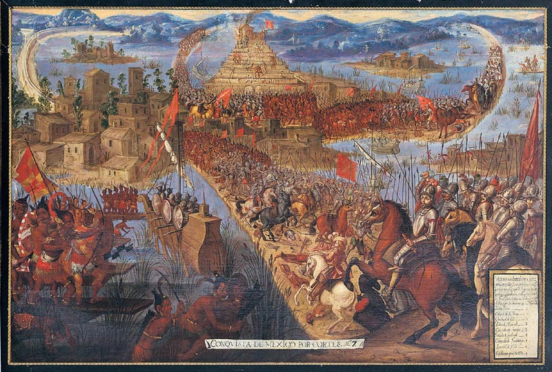
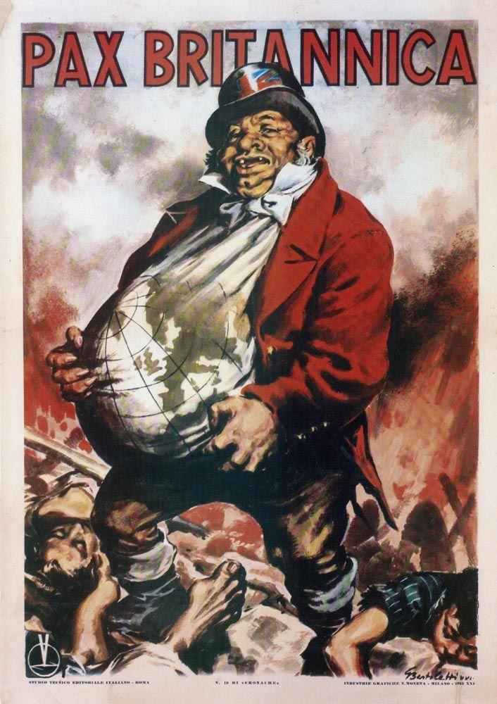
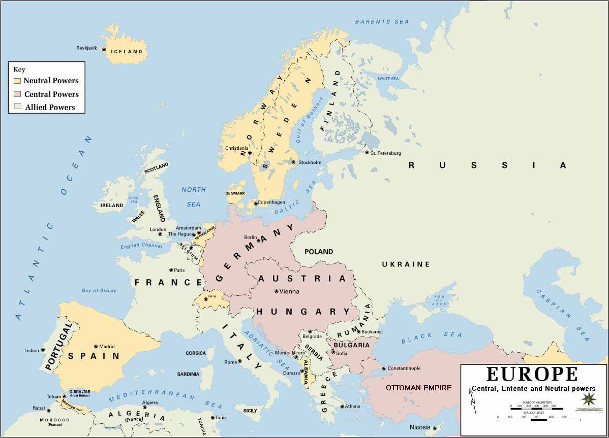
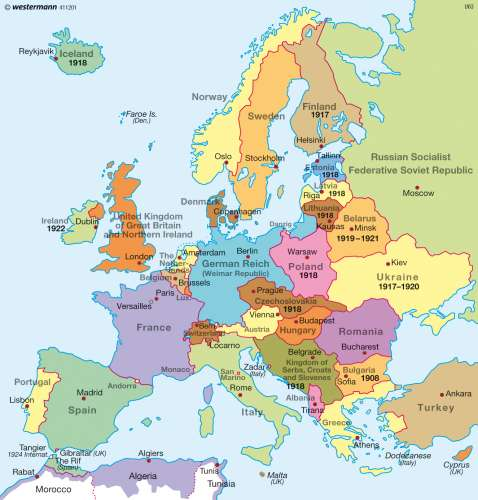
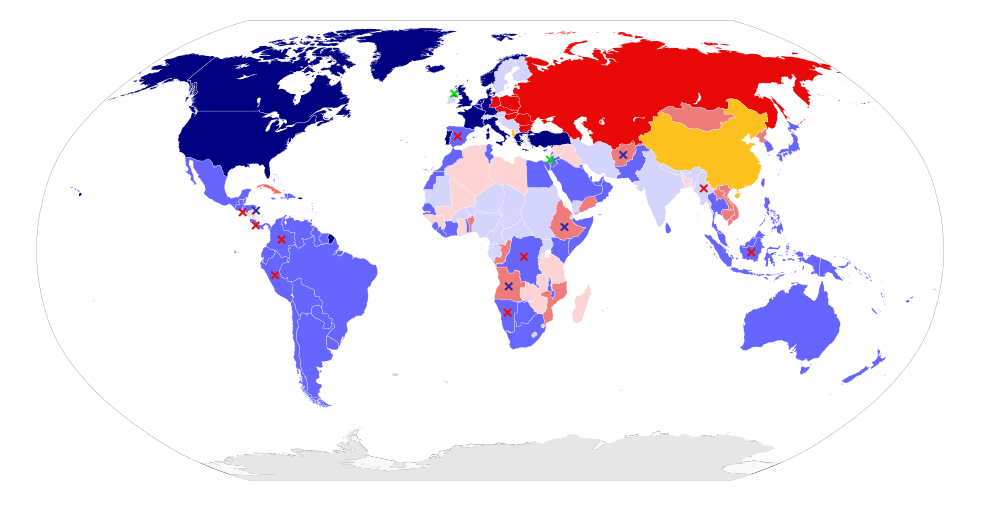
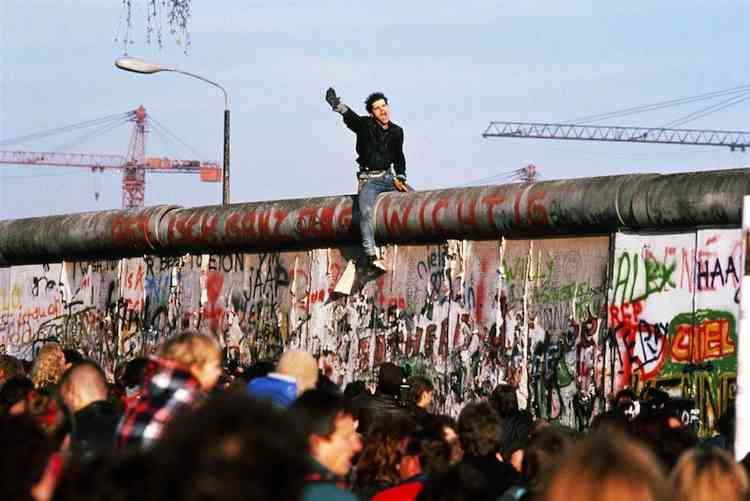

```{r setup, include=FALSE, cache=F, message=F, warning=F, results="hide"}
knitr::opts_chunk$set(cache=TRUE, warning=F)
knitr::opts_chunk$set(fig.path='figs/')
knitr::opts_chunk$set(cache.path='cache/')

knitr::opts_chunk$set(
                  fig.process = function(x) {
                      x2 = sub('-\\d+([.][a-z]+)$', '\\1', x)
                      if (file.rename(x, x2)) x2 else x
                      }
                  )
```

```{r loadstuff, include=FALSE}
knitr::opts_chunk$set(cache=FALSE)

library(tidyverse)
library(stevemisc)
library(maddison)
library(artyfarty)

InterWars <- read_csv("~/Dropbox/data/cow/wars/Inter-StateWarData_v4.0.csv") 
ExtraWars <- read_csv("~/Dropbox/data/cow/wars/Extra-StateWarData_v4.0.csv") 
IntraWars <- read_csv("~/Dropbox/data/cow/wars/Intra-StateWarData_v4.1.csv") 

States <- read_csv("~/Dropbox/data/cow/states/states2016.csv")

States %>%
 #   mutate(endyear = ifelse(endyear == 2011, 2015, endyear)) %>%
    rowwise() %>%
    mutate(year = list(seq(styear, endyear))) %>%
    ungroup() %>%
    unnest() %>%
    arrange(ccode, year) %>%
    select(ccode, year) %>%
    distinct(ccode, year) -> CYs

CYs %>%
  group_by(year) %>%
  summarize(numstates = n()) -> Numstates


```


# Introduction
### Puzzle(s) for Today

*International cooperation is variable through history. Why?*

# Cooperation Through History
###

```{r interstate-war-onsets-decade, echo=F, eval=T, fig.width = 14, fig.height = 8.5}

InterWars %>% distinct(WarName, .keep_all=TRUE) %>%
  mutate(decade = paste0(floor(StartYear1/10)*10,"s")) %>%
  group_by(decade) %>% summarise(numwars = n()) %>%
  ggplot(., aes(decade, numwars)) + theme_steve_web() + 
  geom_bar(stat="identity", alpha=0.8, color="black") +
  geom_text(aes(label=numwars), vjust=-.5, colour="black",
            position=position_dodge(.9), size=3.5,
            family = "Open Sans") +
  xlab("Decade") + ylab("Number of Inter-State Wars") +
  scale_y_continuous(breaks=c(0, 2, 4, 6, 8, 10)) +
  labs(caption="Data: Correlates of War (Inter-State) War Data (v. 4.0). Temporal Domain: 1816-2007.",
       title = "Number of Inter-State War Onsets, by Decade",
       subtitle = "The 1910s had the most unique inter-state war onsets (10) of any decade.")

```

###

```{r percentage-system-interstate-war, echo=F, eval=T, fig.width = 14, fig.height = 8.5, message=F}
InterWars %>% select(WarName, ccode, StartYear1, EndYear1) %>%
  distinct(WarName, ccode, .keep_all=TRUE) %>%
  rowwise() %>%
  mutate(year = list(seq(StartYear1, EndYear1))) %>%
  ungroup() %>%
  unnest() %>%
  group_by(year) %>%
  summarize(n = n()) %>%
  left_join(Numstates, .) %>%
  mutate(n = ifelse(is.na(n), 0, n),
         perc = n/numstates) %>%
  filter(year < 2008) %>%
  ggplot(.,aes(year, perc)) +  theme_steve_web() +
  geom_ribbon(aes(ymin=0, ymax=perc),
              alpha=0.3, fill="#619CFF") +
  scale_y_continuous(labels = scales::percent, limits=c(0,.5)) +
  geom_line(size=1.1) +
  scale_x_continuous(breaks = seq(1810, 2010, by = 10)) +
  xlab("Year") + ylab("Percentage of State System in an Inter-state War") +
  labs(caption = "Data: Correlates of War (Inter-State) War Data (v. 4.0) and State System Membership (to 2016). Temporal Domain: 1816-2007.
       Note: we could use the Gibler-Miller-Little MID data and extend this to 2010 with much better assessments of inter-state war but that wouldn't change the story here.",
       title = "The Percentage of the International System in an Inter-state War, 1816-2007",
       subtitle = "We observe clear spikes in the 1860s, 1910s, and 1940s, which were particularly violent decades.")
  

```

###

```{r interstate-war-battle-deaths-decade, echo=F, eval=T, fig.width = 14, fig.height = 8.5}

InterWars %>%
  mutate(BatDeath = ifelse(BatDeath == -9, 1000, BatDeath)) %>%
  mutate(decade = paste0(floor(StartYear1/10)*10,"s")) %>%
  group_by(decade) %>% summarise(batdeath = sum(BatDeath)) %>%
  ggplot(., aes(decade, batdeath)) + theme_steve_web() + 
  geom_bar(stat="identity", color="black", alpha=0.8) +
  scale_y_continuous(labels = scales::comma) +
  xlab("Decade") + ylab("Number of Estimated Battle Deaths") +
  geom_text(aes(label=formatC(batdeath, format="d", big.mark=",")), vjust=-.5, colour="black",
            position=position_dodge(.9), size=3.5,
            family = "Open Sans") +
  labs(caption="Data: Correlates of War (Inter-State) War Data (v. 4.0). Temporal Domain: 1816-2007.
       Note: Even CoW's most confident estimates are still estimates. Wars with missing fatalities were set at 1,000 (i.e. the minimum operational cutoff).",
       title = "Number of Inter-State War Battle Deaths, by Decade",
       subtitle = "Most wars don't claim a lot of fatalities. The two world wars, on the other hand, claimed a lot of lives.")

```

### Cooperation Through History

Clearly some eras are more peaceful than others.

- The 19th century was more peaceful than the 20th century, although the 1860s was a mess for everyone.
- First half of 20th century brought considerable devastation.
- Post-World War II era (mostly) brought peace among countries.
    - We'll talk about the problem of civil war and terrorism later.
    
Why?

- To answer this question, we'll need to understand how history got us to where we are.

## Mercantilist Era (1492-1815)

###



### Mercantilist Era (1492-1815)

The "world" emerged as a meaningful unit in 1492.

- Portugal and Spain first successfully navigated the world.
- England, France, and Netherlands soon followed.

### Mercantilist Era (1492-1815)

Two goals for Europe's monarchies at the time:

1. Ensure own political and military power.
    - In fact, most of these navigation routes were akin to state secrets.
2. Secure access to resources for commercial class allied with monarchy.
    - i.e. make key supporters happy.
    

### What is Mercantilism?

*Mercantilism* emerged as theme of this era:

- Economic power and military power are equivalent/fungible.
- Establish monopolies to control trade, direct wealth to government or government-supported businesses.
  - e.g. Dutch East Indies Company, Hudson's Bay Company
- Drive down imports from countries and drive up its exports (i.e. maintain favorable balance of trade).

### The Pitfalls of Mercantilism

Mercantilism, notwithstanding its regrettably new currency, has numerous pitfalls.

- e.g. the Virginia colony could only sell tobacco to England and only buy manufactured goods from England.
- As you'll learn in intro to economics, this artificially hurt Virginia's bottom line and artificially helped England's bottom line.

### The Pitfalls of Mercantilism

States obsessed with converting wealth to power and maintaining favorable balance of trade led to major conflicts.

- Portugal and Spain fought over the New World.
- Modern-day Belgium seceded from Spain.
- The British challenged and eventually defeated the Spanish armada.

### The Pitfalls of Mercantilism

The Thirty Years War gave way to Treaty of Westphalia. Effects:

- Creation of the modern "state" system as we know it.
- Significantly neutered the Church as organizing principle in politics.

Successive wars followed, prominently the Napoleonic Wars, that crystalized Britain as world's most powerful state.

##  The Pax Britannica (1815-1914)

###



### The Pax Britannica (1815-1914)

General themes from this era:

- "Hundred Years' Peace"
- Emergence of free trade
- Organized "gold standard"

### 

```{r historical-gdppc-1700-1920-fra-gmy-ukg-usa, echo=F, eval=T, fig.width = 14, fig.height = 8.5, warning = F}

maddison %>%
  filter(country == "United Kingdom" | country == "United States" | 
           country == "France" | country == "Russia" |
           country == "Germany") %>%
  rename(Country = country) %>%
  filter(year > "1699-01-01" & year <= "1914-01-01") %>%
  mutate(year = as.numeric(stringr::str_sub(year, 1, 4))) %>%
  ggplot(.,aes(year, gdp_pc, color = Country, linetype=Country)) + theme_steve_web() + 
  annotate("rect", fill = "gray", alpha = 0.5, 
        xmin = 1815, xmax = 1914,
        ymin = -Inf, ymax = Inf) +
  geom_line(size=1.1) +
  scale_y_continuous(labels = scales::comma) +
  scale_x_continuous(breaks = seq(1700, 1920, by=10)) +
  scale_color_manual(values = pal("few_dark")) +
  annotate("text", x = 1820, 
           y = 5000, hjust=0, family="Open Sans",
           label = "Pax Britannica (1815-1914)") +
  ggtitle("Historical GDP per Capita Data for Select Countries, 1700-1920") +
  xlab("Year") + ylab("GDP per Capita") +
  labs(caption = "Source: Maddison Historical GDP Data (CRAN: maddison). Values denominated in 1990 USD.",
       subtitle= "Britain's economy was the largest in the world during Pax Britannica, up until World War I, and leading powers began to see heretofore unprecedented growth at this time.")

```

### More Specific Comments About the Pax Britannica

Not all "peace" was peaceful.

- Important security issues concerned revolutionaries/anarchists that threatened nobility,  consolidation of Germany and Italy, and Ottoman Empire as "sick man of Europe."

We have Britain to thank for much of what U.S. would later implement after WWII:

- Free trade followed British industrialist desires and served British political goals and overall welfare.

### More Specific Comments About the Pax Britannica

Imperialism actually went *down* for a period during the Scramble for Africa.

- Part of the reason: significantly weakened Portugal/Spain.
- Emergence of Germany and Italy and a more ambitious Russia, U.S., and Japan changed this.

###

```{r extrastate-war-onsets-decade, echo=F, eval=T, fig.width = 14, fig.height = 8.5}

ExtraWars %>% distinct(WarName, .keep_all=TRUE) %>%
  mutate(decade = paste0(floor(StartYear1/10)*10,"s")) %>%
  group_by(decade) %>% summarise(numwars = n()) %>%
  ggplot(., aes(decade, numwars)) + theme_steve_web() +
  geom_bar(stat="identity", color="black", alpha=0.8, fill="#619cff") +
  xlab("Decade") + ylab("Number of Extra-State Wars") +
  geom_text(aes(label=numwars), vjust=-.5, colour="black",
            position=position_dodge(.9), size=3.5,
            family = "Open Sans") +
  scale_y_continuous(breaks=c(0, 2, 4, 6, 8, 10, 12, 14, 16, 18, 20, 22)) +
  labs(caption="Data: Correlates of War (Extra-State) War Data (v. 4.0). Temporal Domain: 1816-2007.",
       title = "Number of Extra-State War Onsets, by Decade",
       subtitle = "Extra-state wars were common in the 19th century have effectively disappeared in the decades after European empires ended as a result of World War II.")

```

###

```{r percentage-system-extrastate-war, echo=F, eval=T, fig.width = 14, fig.height = 8.5, message = F}
ExtraWars %>% select(WarName, ccode1, StartYear1, EndYear1) %>%
  distinct(WarName, ccode, .keep_all=TRUE) %>%
  rowwise() %>%
  mutate(year = list(seq(StartYear1, EndYear1))) %>%
  ungroup() %>%
  unnest() %>%
  group_by(year) %>%
  summarize(n = n()) %>%
  left_join(Numstates, .) %>%
  mutate(n = ifelse(is.na(n), 0, n),
         perc = n/numstates) %>%
  filter(year < 2008) %>%
  ggplot(.,aes(year, perc)) +  theme_steve_web() +
  geom_ribbon(aes(ymin=0, ymax=perc),
              alpha=0.3, fill="#619CFF") +
  scale_y_continuous(labels = scales::percent, limits=c(0,.5)) +
  geom_line(size=1.1) +
  scale_x_continuous(breaks = seq(1810, 2010, by = 10)) +
  xlab("Year") + ylab("Percentage of State System in an Extra-state War") +
  labs(caption = "Data: Correlates of War (Extra-State) War Data (v. 4.0) and State System Membership (to 2016). Temporal Domain: 1816-2007.",
       title = "The Percentage of the International System in an Extra-state War, 1816-2007",
       subtitle = "The spike in unique onsets in the 1890s notwithstanding, the history is of extra-state wars is one of general decline after the War of 1812.")
  

```


## The Thirty Years' Crisis (1914-1945)
### The Thirty Years' Crisis (1914-1945)

The mechanisms of securing the Pax Britannica started to weaken late in 19th century.

- Major reason: Germany.
- Other reasons: weakened Austria-Hungary, Ottoman Empire, rigid, if sometimes overlapping alliance commitments (see: Italy, pre-WWI)

World War I, "the war to end all wars," had major destabilizing effects on international politics.


###



###



### The Thirty Years' Crisis (1914-1945)

World War I resulted in another post-war concert like the Congress of Vienna to secure the world order. This failed because:

- League of Nations lacked bite on a lot of measures.
    - U.S. absence hurt but would not have saved it.
- Germany was sufficiently humiliated and stuck with too big a war debt.
- Italy's territorial ambitions weren't satisfied from World War I.

The Great Depression brought back many mercantilist policies that'd help make the next war even worse.

## The Cold War (1945-1990)
### The Cold War (1945-1990)

Briefly, why these two at this time:

- The U.S., blessed by geography and scale, was the only country after WWII that wasn't bleeding. But:
- The USSR was by far the most militarized country in the world and (seriously) could've won WWII by itself.

The U.S. was blessed with opportunity to implement numerous institutions in its image.

- e.g. United Nations, Bretton Woods

However, the Soviets had an alternative model. 

- Both became suspicious of the other's intentions.

###



### The Cold War (1945-1990)

Some themes from this era.

- The gold standard ends with "Nixon shock." It was effectively a victim of the success of the Marshall Plan.
- Decolonization, largely driven by the U.S.
- World really was black/white (and quite tense!) early into Cold War.
- Soviets eventually integrated into U.S. system.
    - Their model and institutions lacked legitimacy.
- Emergence of third world, Sino-Soviet split, detente, and soft decline of U.S. after Vietnam.

## Post Cold-War (1991-Present)
### 



### Post Cold-War (1991-Present)

Themes of this era:

- Acceleration of U.S. institutions policies, absent alternatives.
    - See: NAFTA, WTO, NATO expansion, etc.
- Explosion of civil wars
- New diplomatic challenges ("abandonment", "entrapment").


###

```{r intrastate-war-onsets-by-decade, echo=F, eval=T, fig.width = 14, fig.height = 8.5}

IntraWars %>% distinct(WarName, .keep_all=TRUE) %>%
  mutate(decade = paste0(floor(StartYear1/10)*10,"s")) %>%
  group_by(decade) %>% summarise(numwars = n()) %>%
  ggplot(., aes(decade, numwars)) + theme_steve_web() + 
  geom_bar(stat="identity", alpha=0.8, color="black") +
  xlab("Decade") + ylab("Number of Intra-State Wars") +
  scale_y_continuous(breaks=seq(0, 42, 2)) +
  geom_text(aes(label=numwars), vjust=-.5, colour="black",
            position=position_dodge(.9), size=3.5,
            family = "Open Sans") +
  labs(caption="Data: Correlates of War (Intra-State) War Data (v. 4.1). Temporal Domain: 1816-2007.",
       title = "Number of Intra-State War Onsets, by Decade",
       subtitle = "Consistent with casual observation, the end of the Cold War saw a surge in civil war onsets in the 1990s. The 41 onsets is the most of any decade on record.")

```


###

```{r percentage-system-intrastate-war, echo=F, eval=T, fig.width = 14, fig.height = 8.5, message=F}
IntraWars %>% rename(ccode1 = CcodeA) %>%
  select(WarName, ccode1, StartYear1, EndYear1) %>%
  mutate(EndYear1 = ifelse(EndYear1 == -7, 2007, EndYear1), #ongoing as of 2007
         EndYear1 = ifelse(is.na(EndYear1), StartYear1, EndYear1)) %>% # if it's missing, just make it the start year
  distinct(WarName, ccode, .keep_all=TRUE)%>%
  rowwise() %>%
  mutate(year = list(seq(StartYear1, EndYear1))) %>%
  ungroup() %>%
  unnest() %>%
  group_by(year) %>%
  summarize(n = n()) %>%
  left_join(Numstates, .) %>%
  mutate(n = ifelse(is.na(n), 0, n),
         perc = n/numstates) %>%
  filter(year < 2008) %>%
  ggplot(.,aes(year, perc)) +  theme_steve_web() +
  geom_ribbon(aes(ymin=0, ymax=perc),
              alpha=0.3, fill="#619CFF") +
  scale_y_continuous(labels = scales::percent, limits=c(0,.5)) +
  geom_line(size=1.1) +
  scale_x_continuous(breaks = seq(1810, 2010, by = 10)) +
  xlab("Year") + ylab("Percentage of State System in an Intra-state War") +
  labs(caption = "Data: Correlates of War (Intra-State) War Data (v. 4.1) and State System Membership (to 2016). Temporal Domain: 1816-2007.",
       title = "The Percentage of the International System in an Intra-state War, 1816-2007",
       subtitle = "It's easy to think of civil war as mostly a post-empire and post-Cold War problem, though that belies important patterns we observe in the 19th century.")
  

```


# Conclusion: Future Challenges
### Conclusion: Future Challenges

- Limits of U.S. military power after Iraq and Afghanistan
- Failure of nation building
- Economic globalization
- BRICs
- The Rise of China
- Persistence of poverty in much of the globe
- How will international actors address these challenges?


### PSA

For those new to the course:

- Go to http://posc1020.svmiller.com
    - Lecture slides there as well.
- Check Canvas too, just in case.