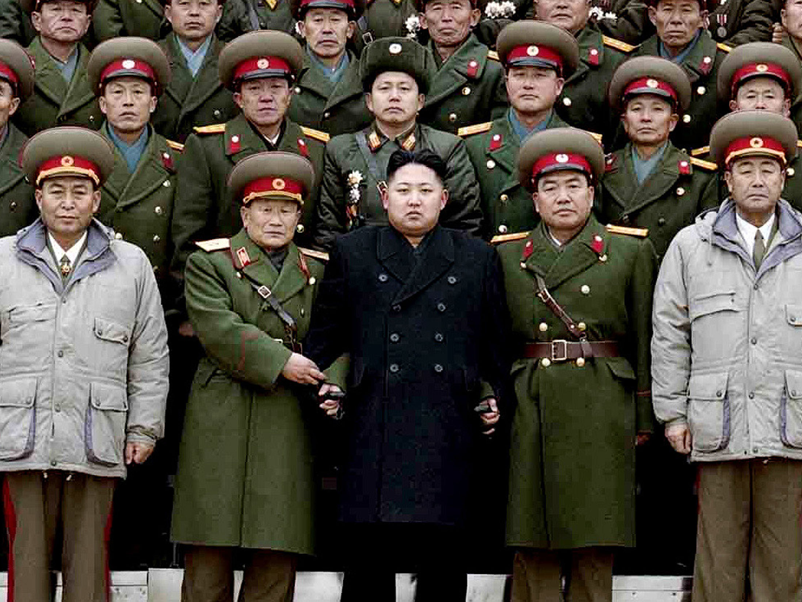

```{r setup, include=FALSE, cache=F, message=F, warning=F, results="hide"}
knitr::opts_chunk$set(cache=TRUE, warning=F)
knitr::opts_chunk$set(fig.path='figs/')
knitr::opts_chunk$set(cache.path='cache/')

knitr::opts_chunk$set(
                  fig.process = function(x) {
                      x2 = sub('-\\d+([.][a-z]+)$', '\\1', x)
                      if (file.rename(x, x2)) x2 else x
                      }
                  )
```

```{r loadstuff, include=FALSE}


library(WDI)
library(tidyverse)
library(stevemisc)
# library(maddison)

```

# Introduction
### Puzzle(s) for Today

*What explains these patterns of world politics (i.e. war and peace, cooperation and conflict) we discussed?*

# Interests, Interactions, and Institutions
### Interests, Interactions, and Institutions

The authors believe the answer lay in understanding this alliteration.

1. Interests: the actors involved, and their preferences
2. Interactions: i.e. cooperation, bargaining, public goods, and collective action
3. Institutions: can facilitate or constrain behavior

## Interests (Actors and Preferences)
### 




### Actors

Traditional IR paradigms "black boxed" the state.

- definition, per Weber: "the monopoly of the legitimate use of violence within a given territory."
- States had few ("national") interests. Typically: power (c.f. classical realism), security (c.f. neorealism), or policy (c.f. power transition theory).

However, this "black boxing" of the state is unsatisfactory and leaves more questions than answers.

### Actors

A better typology of actors:

- Generally, we care first about state leaders (i.e. presidents, kings, prime ministers).
- These state leaders are ultimately responsible for policymaking to meet their own interests.
- These interests: typically tenure (i.e. holding office/the regime).

### Actors

Heads of state rely on making a group of people happy to meet their own interests (i.e. tenure).

- We call this group the **winning coalition**.

The size of the **winning coalition** typically varies across state types. Examples:

- Democracies: generally 50%+1 of eligible voters. Exclusion rules apply (see: U.S.).
- Autocracies: much, much smaller % of the population.

For example: Kim Jong-Un needs to bribe a handful of generals with fine cigars and courvoisier to keep his spot.

### Actors and Preferences

| Actor | Preferences | Comments |
|:------------|:------------|:----------------------------------------|
| States | power, security, prosperity | discussed in "systemic" analyses |
| State leaders    | tenure, various policy goals | see: selectorate theory |
| Businesses/firms | profit | typically big players in the winning coalition |
| Classes | material well-being | see: Marxism |
| Bureaucrats | budget maximization, influence | also key players in winning coalition | 
| IGOs | reflect interests of their members |  |
| NGOs | policy goals | may also be part of winning coalition |

## Interactions
### Interactions

The problem of international politics:

- Actors compete for scarce resources.
- They compete under conditions of anarchy.
- This makes all interactions fundamentally *strategic.*

### Clarifying What We Mean

We're making two assumptions here worth clarifying:

1. Actors are *rational* the extent to which they have interests, rank possible outcomes, and work toward maximizing utility.
2. Actors are *strategic* because they must condition their choice based on the expected response of other actors.

### An Illustration of Cooperation

Stag Hunt is a useful illustration of how cooperation can improve quality of life. Consider:

- Hunter 1 and Hunter 2 are trying to take down a deer.
- Both need to shoot the deer (i.e. "cooperate") in order to get yummy deer meat.
- However, if one is unsure the other will shoot the deer, s/he can shoot a bunny (i.e. "defect") for a smaller dinner.


### The Stag Hunt Payoff Matrix

|                         | H2 Cooperates       | H2 Defects |
|-------------------------|---------------------|------------------|
| H1 Cooperates           |  4, 4         |  0, 2       |
| H1 Defects              |   2, 0        |  2, 2        |

Note that the payoffs for the first player (here: Hunter 1) are listed first.

### Solving This Game

Solving this (or most any) game requires finding a **Nash equilibrium**.

- Definition: the outcome of a game when no player has an incentive to *unilaterally* change behavior.

How can you find this?

- Find best responses for each potential decision and highlight it for a specific player.
- The quadrant(s) where each payoff is highlighted is a Nash equilibrium.


### The Stag Hunt Payoff Matrix

|                         | H2 Cooperates | H2 Defects |
|-------------------------|---------------------|------------------|
| H1 Cooperates |  **4, 4**         |  0, 2       |
| H1 Defects    |   2, 0         |  **2, 2**        |

### So Why Do Actors Cooperate?

Implications from the stag hunt:

- Actors cooperate because they *trust* the other side will cooperate.
- Cooperation creates abundance for both sides in this scenario.
- If you don't trust the other side, cooperation is hard to start.
- If you've been cooperating, breaking that trust seems impractical and makes no side better off.

### Not All Cooperation is Simple


The **prisoner's dilemma** is one of the most ubiquitous pedagogical games in game theory.

- It’s a useful description for most of international politics.
- In short: it’s a situation when the mutually optimal outcome is individually irrational.
	- Much like the heart of international politics.
- Demonstrates individual-level pursuit of self-interest can have perverse group consequences.


### The Situation

The players (Criminal 1, Criminal 2) have just robbed a bank.

- The police has insufficient evidence for a serious conviction.
- The po-po has only enough evidence for a minor, unrelated conviction.

In custody, detectives isolate the criminals and try to coerce a confession.

- Assume there's a prior commitment from both criminals to clam up.
- However, this can't be enforced (noncooperative game theory).

### The Situation and the Payoffs

The criminals have only two choices: cooperate (with each other, by clamming up) or defect to the police.

- If they both keep quiet: police can only pursue the minor conviction.
- If one defects while the other keeps quiet: the rat turns state's evidence, the other gets the books thrown at him.
- If they both rat on each other, they get a partial sentence for making things easy for prosecutors.

### The Prisoner's Dilemma Payoff Matrix

|                         | C2 Cooperates | C2 Defects |
|-------------------------|---------------------|------------------|
| C1 Cooperates |  -1, -1        |  -10, 0       |
| C1 Defects    |   0, -10         |  -6, -6        |

Again, find best responses to locate the Nash equilibrium. 

### The Prisoner's Dilemma Payoff Matrix

|                         | C2 Cooperates | C2 Defects |
|-------------------------|---------------------|------------------|
| C1 Cooperates |  -1, -1         |  -10, **0**       |
| C1 Defects    |   **0**, -10         |  **-6, -6**        |

### The Implications of the Prisoner's Dilemma

In situations with payoffs structured like the prisoner's dilemma, the prospects for cooperation versus conflict look dim.

- Defect is a **dominant strategy**. Each player is better off defecting no matter what the other player does.
- Ideal payoffs per player: *DC > CC > DD > CD*.
	- *Ordinal* payoffs are all that matter in a single-shot game.
- The Nash equilibrium is **Pareto inferior**.
	- The "best" outcome is when no player can maximize her payoff without making some other player worse off is the **Pareto efficient** outcome.
	- Clearly, the Pareto efficient outcome is *CC*, though rational players won't choose *C*.
	
	
## Institutions
### Institutions 

Institutions may help actors overcome the temptation to defect, uncertainty, and lack of information.

### Institutions

Institutions may have enforcement mechanisms and can authorize punishment. Examples: 

- WTO agreements are binding and enforceable.
- The IMF imposes conditionality on borrowers (loans conditional on certain behavior).
- Coordination and self-enforcing: air traffic controllers agree to use English.

The more specific the standards for behavior, the more effectively they can promote compliance.


### Some Quirks About Institutions

Who benefits from institutions in international politics?

- Post-WWII concert (i.e. the Power Five in the UN)
- The West
    - e.g. IMF rules give enough votes to the U.S. and Europe that allow effective vetos.
- Powerful/rich countries (see above)

###
```{r imf-voting-power, echo=F, eval=T, fig.width = 14, fig.height = 8.5, warning = F, message = F}
IMF <- readxl::read_xlsx("~/Dropbox/teaching/posc1020/development-1/Quota_SDRs.xlsx", sheet=2) %>% 
  slice(1:5) %>% rename(Category = 1)
  

WDI(country=c("1W", "XM", "XN", "XD"), 
    indicator = "SP.POP.TOTL", 
    start=1960, end=2017) %>% tbl_df() %>%
  group_by(year) %>%
  mutate(worldpop = max(SP.POP.TOTL)) %>%
  filter(iso2c != "1W") %>%
  mutate(Category = ifelse(iso2c == "XD", "High Income", "Low and Lower Middle Income")) %>%
  group_by(Category, year, worldpop) %>%
  summarize(pop = sum(SP.POP.TOTL)) %>%
  mutate(perc = pop/worldpop,
         Year = year) %>%
  mutate(data = "Population Percentages/World Total") -> popprops
  
IMF %>%
  gather(Year, Value, `1950`:`2016`) %>%
  group_by(Year) %>%
  mutate(perc = Value/max(Value)) %>%
  ungroup() %>%
  mutate( Year = as.numeric(Year)) %>%
  filter(Category != "World") %>%
  filter(Category == "Advanced Economies" | Category == "Emerging and Developing Countries") %>%
  mutate(data = "IMF Vote Share") -> imfshares

imfshares %>%
  ggplot(.,aes(Year, perc, color=Category, group=Category,linetype=Category)) + theme_steve_web() +
  geom_line(size=1.1) +
  scale_x_continuous(breaks=seq(1950, 2015, by =5)) +
  scale_y_continuous(labels=scales::percent,
                     breaks = seq(.2, .8, .1)) +
  geom_hline(yintercept = .5, linetype="dashed", color="grey66") +
  scale_color_brewer(palette="Set1") +
  xlab("Year") + ylab("Percentage of Voting Power") +
  labs(title = "IMF Voting Rules Privilege the Wealthy States Over the Developing States",
       subtitle = "Voting power is weighted by economic size/openness/reserves in the IMF, which favor countries like the U.S. despite the majority of the world's population residing in poorer countries.",
       caption = "Data: International Monetary Fund")

```

### Some Quirks About Institutions

When do institutions fail to promote cooperation:

- Generally: when cost of compliance is too high or payoff to defect is too large.

# Conclusion
### Conclusion

- Interests (actors and preferences) are the key stuff to understanding all politics.
- All politics is strategic interaction.
    - We'll discuss the problem of bargaining more when we get to war.
- Institutions are rules that constrain and enable interaction
    - Institutions are not neutral; actors struggle to tilt them in their favor.

