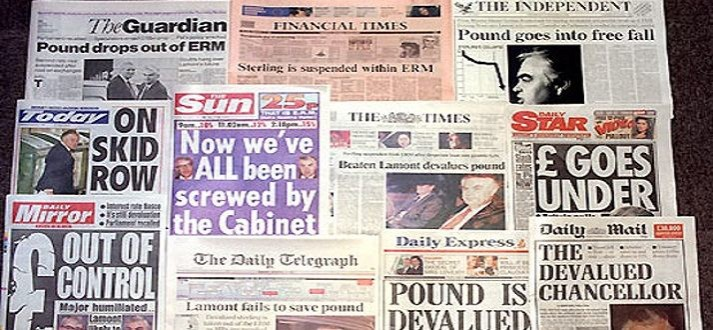

```{r setup, include=FALSE, cache=F, message=F, warning=F, results="hide"}
knitr::opts_chunk$set(cache=TRUE)
knitr::opts_chunk$set(fig.path='figs/')
knitr::opts_chunk$set(cache.path='cache/')

knitr::opts_chunk$set(
                  fig.process = function(x) {
                      x2 = sub('-\\d+([.][a-z]+)$', '\\1', x)
                      if (file.rename(x, x2)) x2 else x
                      }
                  )
```

```{r loadstuff, include=FALSE}
knitr::opts_chunk$set(cache=FALSE)

library(tidyverse)
library(lubridate)
library(stringr)
library(stevemisc)
library(scales)
library(WDI)
library(pwt9)
library(artyfarty)
data("pwt9.0")

pwt <- pwt9.0

Traden <- read.csv("~/Dropbox/data/cow/trade/National_COW_4.0.csv") %>% tbl_df()
Traded <- read.csv("~/Dropbox/data/cow/trade/Dyadic_COW_4.0.csv") %>% tbl_df()

ukgeer <- read_csv("~/Dropbox/teaching/posc1020/monetary-relations-2/ukg-reer-results.csv") %>%
  mutate(Date = as.Date(DATE, "%d %b %Y"))

library(fredr)
library(PBSmapping)


recessions = read.table(textConnection(
"Peak, Trough
1857-06-01, 1858-12-01
1860-10-01, 1861-06-01
1865-04-01, 1867-12-01
1869-06-01, 1870-12-01
1873-10-01, 1879-03-01
1882-03-01, 1885-05-01
1887-03-01, 1888-04-01
1890-07-01, 1891-05-01
1893-01-01, 1894-06-01
1895-12-01, 1897-06-01
1899-06-01, 1900-12-01
1902-09-01, 1904-08-01
1907-05-01, 1908-06-01
1910-01-01, 1912-01-01
1913-01-01, 1914-12-01
1918-08-01, 1919-03-01
1920-01-01, 1921-07-01
1923-05-01, 1924-07-01
1926-10-01, 1927-11-01
1929-08-01, 1933-03-01
1937-05-01, 1938-06-01
1945-02-01, 1945-10-01
1948-11-01, 1949-10-01
1953-07-01, 1954-05-01
1957-08-01, 1958-04-01
1960-04-01, 1961-02-01
1969-12-01, 1970-11-01
1973-11-01, 1975-03-01
1980-01-01, 1980-07-01
1981-07-01, 1982-11-01
1990-07-01, 1991-03-01
2001-03-01, 2001-11-01
2007-12-01, 2009-06-01"), sep=',',
colClasses=c('Date', 'Date'), header=TRUE) 

```


# Introduction
### Puzzle(s) for Today

*How do governments form international monetary regimes and when are they stable?*

### Can There Be Money Without A World Government?

Yes (clearly) but it's tricky.

- National monetary systems are a classic public good but exist only in relation to others.
- International monetary regimes normalize prices across borders.

Everyone is better off for an international monetary regime (IMR) but preferences vary.

- Absent a world government, IMRs are more informal and require voluntary cooperation.


### International Monetary Regimes as Prisoner's Dilemma

IMRs resemble a prisoner's dilemma.

- Mutual cooperation provides a Pareto improvement.
- However, cooperation requires an individual commitment that might be untenable.
- Temptations to "cheat" (i.e. devalue currency) are strong (especially in fixed-rate orders)
- If everyone does this, the IMR collapses.

# The Evolution of International Monetary Regimes
### How Do IMRs Evolve?

IMRs evolve/grow around two basic principles.

- To fix or float (or some combination of both)
- To benchmark against a commodity, paper, or commodity-backed paper.

This will provide a simple way of categorizing the three main IMRs we've observed.

## The History of Our Major IMRs
### The Gold Standard

The most famous regime fixed to gold or gold-backed currencies.

- Required priority of gold and participation in global economy (i.e. why China and Persia did not participate).
- Required close ties among states with major misgivings: Britain, France, Germany.

### The Gold Standard


Gold was stable and predictable, facilitating trade, investment, and finance. But:

- Gold standard hurt poorer, developing, and indebted countries (e.g. the U.S.).
- Curtailed ability to respond to economic crises (see: Great Depression)
- Importantly: required participation from the three major financial powers.

The gold standard as IMR was overwhelmed by major crises and wars.

### The Bretton Woods Monetary System

U.S. and British economists convened in New Hampshire to revise the gold standard.

- Organized it instead around the U.S. dollar.
- The dollar was then tied to gold at fixed rate ($35/oz).
- Other currencies were tied to the dollar with an adjustable peg.
- Also: IMF founded to monitor exchange rates.

This facilitated investment and globalization but gave governments some autonomy to adjust.

### The Bretton Woods Monetary System

The country most hamstrung by Bretton Woods was the U.S.

- The hard $35/oz commitment became untenable amid U.S. economic problems.


###

```{r us-gdp-perc-world-1950-1972, echo=F, eval=T, fig.width = 14, fig.height = 8.5, warning = F, message = F}
pwt9.0 %>%
  group_by(year) %>%
  mutate(usgdp = rgdpna[isocode == "USA"]) %>%
  group_by(year) %>%
  summarize(usgdpperc = unique(usgdp)/sum(rgdpna, na.rm=T)) %>%
  filter(year <= 1972) %>%
  ggplot(.,aes(year, usgdpperc)) + theme_steve_web() + 
  scale_y_continuous(labels = scales::percent) +
  scale_x_continuous(breaks = seq(1950, 1972, by=2)) +
  geom_line(size=1.1) +
  xlab("Year") + ylab("U.S. GDP as a percentage of world GDP") +
  geom_ribbon(aes(ymin=-Inf, ymax=usgdpperc),
              alpha=0.3, fill="#619CFF") +
  labs(title = "The U.S. Share of Global Economic Output Fell Over 34% from 1950 to 1970",
       subtitle = "The causes were multiple, but ultimately jeopardized faith in the Bretton Woods monetary system.",
       caption = "Data: Penn World Table (v. 9.0)")
```

###


```{r us-gold-reserves-perc-world-1960-1970, echo=F, eval=T, fig.width = 14, fig.height = 8.5, warning = F, message = F}
WDI(country="all", indicator = c("FI.RES.TOTL.CD","FI.RES.XGLD.CD"), start=1960, end=1970) %>% tbl_df() %>%
  rename(totreserves = `FI.RES.TOTL.CD`, totreservesmingold = `FI.RES.XGLD.CD`) %>%
  mutate(goldrev = totreserves - totreservesmingold) %>% filter(totreserves > 0) %>%
  group_by(year) %>%
  mutate(usgoldreserves = goldrev[iso2c == "US"]) %>%
  group_by(year) %>%
  summarize(usreservesperc = unique(usgoldreserves)/sum(goldrev, na.rm=T)) %>%
  mutate(lab = paste0(mround2(usreservesperc),"%")) %>%
  ggplot(.,aes(as.factor(year), usreservesperc)) + theme_steve_web() +
  geom_bar(stat="identity", position = "dodge", alpha = I(0.6),color = I("black"), fill="gold4") +
  scale_y_continuous(labels = scales::percent) +
  geom_text(aes(label=lab), vjust=-.5, colour="black",
            position=position_dodge(.9), size=4) +
  xlab("Year") + ylab("U.S. Gold Reserves as Percent of World Reserves") +
  labs(title = "U.S. Estimated Gold Reserves Fell Over 37% From 1960 to 1970",
       subtitle = "This created major problems the extent to which the Bretton Woods monetary system was anchored to the volume of gold reserves the U.S. had in supply.",
       caption = "Data: World Bank API. Gold reserves estimated subtracting total reserves (minus gold) from total reserves (including gold).")

```

### "Nixon Shock"

"Nixon shock" followed by executive order, which:

- dropped the link to gold and allowed the value of its currency to float.
- imposed a 90-day freeze on wages and prices.
- placed an import surcharge of 10 percent.

This was politically successful, but may have foretold a "lost decade" of stagflation for the U.S.

###

```{r cpi-usa-1968-1981, echo=F, eval=T, fig.width = 14, fig.height = 8.5, warning = F, message = F}

fredr(series_id = "CPALTT01USM659N",
      observation_start = as.Date("1968-01-01"),
      observation_end = as.Date("1981-01-01")) %>%
  ggplot(.,aes(date, value)) + 
    geom_line(size=1.1) + 
    geom_ribbon(aes(ymin=-Inf, ymax=value),
              alpha=0.3, fill="#619CFF") +
    theme_steve_web() +
  geom_rect(data=filter(recessions, year(Peak) > 1967 & year(Peak) < 1981), inherit.aes=F, aes(xmin=Peak, xmax=Trough, ymin=-Inf, ymax=+Inf),  alpha=0.4) + 
  geom_vline(xintercept = as.Date("1971-08-13")) +
  scale_x_date(date_breaks = "1 year", 
               date_minor_breaks = "2 months", 
               date_labels = "%Y") +
  annotate("text", 
           label = "'Nixon Shock'\n(Aug. 13, 1971)",
           x=as.Date("1971-09-13"), y=10, hjust=0) +
  xlab("") + ylab("Growth Rate Same Period (Previous Year)") +
  labs(caption = "Data: Organization for Economic Co-operation and Development, via FRED API. Shaded areas indicate recessions.",
       title = "The 'Stagflation' of the 1970s Was a Legacy of 'Nixon Shock'",
       subtitle = "The decisions Nixon announced on Aug. 13, 1971 were a short-term success but led to the 1973-5 recession and resonated into the Carter presidency.")

```


### The Present International Monetary Regime

Today: the biggest financial actors (e.g. US, Japan, Britain, Europe) float their currencies at market values.

- Concerns for volatile shifts still fall under purview of IMF.

However, concerns persist:

- Dollar standard comes with concerns for wide fluctuations in the value of the dollar.
- Smaller countries are reticent to do this and typically fix to some standard.
    - e.g. West Africa is on the franc and many South American countries peg to USD.
    
### The Euro

The euro is arguably the most conspicuous IMR today. A brief history:

- Discussion about stabilizing exchange rates starts in earnest after Nixon shock.
- Previously: pegged to Deutschmark (as largest economy in Europe).
    - However, this was a commitment some countries like France and Italy were reticent to make.
    
This led to a rather rigid/conflictual commitment for most of Europe.

- Inflation crisis post-unification magnified this.
- What followed: tit-for-tat interest rate hikes, and breaking the link to the Deutschmark.

### The Euro

Eventually: the Eurozone wanted to "Europeanize" (sic) the German standard and model.

- For Europe: allow input to monetary relations that revolved around Germany.
- For Germany: use its model as benchmark for other monetary regimes in the region.
- For both: mutual cooperation has its benefits.

<!-- 

###


-->

###

```{r emu-countries-2018, echo=F, eval=T, fig.width = 14, fig.height = 8.5, warning = F, message = F}

world = map_data('world')

aggregate(cbind(long, lat, group, order) ~ region, data=world, 
                    FUN=function(x)mean(range(x))) %>%
  rename(X=long, Y=lat, PID=group, POS=order) %>%
  mutate(Category = NA) %>% 
  clipPolys(xlim=c(-50, 45), ylim=c(30, 68), keepExtra=TRUE) %>%
  mutate(region = as.character(region)) %>%
  tbl_df() %>%
  mutate(region = ifelse(PID == 854, "Italy", region),
         region = ifelse(PID == 265, "Finland", region),
         region = ifelse(PID == 462, "Cyprus", region),
         region = ifelse(PID == 956, "Lithuania", region),
         region = ifelse(PID == 478, "Denmark", region),
         region = ifelse(PID == 513, "Estonia", region),
         region = ifelse(PID == 993, "Malta", region),
         region = ifelse(PID == 626, "Greece", region),
         region = ifelse(PID == 1391, "Sweden", region),
         region = ifelse(PID == 844, "Ireland", region),) %>% 
  bind_rows(.,tibble(PID = 1057, POS = 66957, order=NA, X= 4.226171,
                     Y =52.38647, region = "Netherlands", Category = NA )) %>% 
  mutate(Y = ifelse(region == "Finland", Y-3, Y),
         Y = ifelse(region == "Malta", Y-.7, Y),
         Y = ifelse(region == "Cyprus", Y-.7, Y),
         Y = ifelse(region == "Greece", Y-2.25, Y),
         Y = ifelse(region == "Italy", Y+1, Y),
         Y = ifelse(region == "Sweden", Y-3, Y),
         X = ifelse(region == "Sweden", X-3, X),
         X = ifelse(region == "Ireland", X-5, X),
         X = ifelse(region == "Austria", X+1.5, X),
         X = ifelse(region == "Greece", X-3, X),
         Y = ifelse(region == "Netherlands", Y+1.5, Y),
         Y = ifelse(region == "Belgium", Y+.5, Y),
         X = ifelse(region == "Netherlands", X-.5, X),
         X = ifelse(region == "Portugal", X-5, X),) %>%
  mutate(Category=ifelse(region %in% c('Austria', 'Belgium', 'Finland', 'France', 'Germany',
                                'Ireland', 'Italy', 'Luxembourg', 'Netherlands',
                                'Portugal', 'Spain'), "Original Members", NA),
         Category = ifelse(region %in% c('Cyprus', 'Estonia', 'Greece',
                                         'Latvia', 'Lithuania', 'Malta',
                                         'Slovakia', 'Slovenia'),
                           "Members After 2001", Category),
         Category = ifelse(region %in% c('Bulgaria', 'Croatia',
                                         'Czech Republic', 'Hungary',
                                         'Poland', 'Romania', 'Sweden'),
                           "Countries in Process of Joining Euro", Category),
         Category = ifelse(is.na(Category), "Not Members", Category),
         Category = forcats::fct_relevel(Category,
                                         "Original Members",
                                         "Members After 2001",
                                         "Countries in Process of Joining Euro")) %>%
  filter(Category != "Not Members") %>% tbl_df() %>%
  mutate(region = forcats::fct_recode(region,
                                      "Czechia" = "Czech Republic")) -> cnames

world %>%
  rename(X=long, Y=lat, PID=group, POS=order) %>%
  clipPolys(xlim=c(-50, 45), ylim=c(30, 68), keepExtra=TRUE) %>% 
  mutate(Category=ifelse(region %in% c('Austria', 'Belgium', 'Finland', 'France', 'Germany',
                                'Ireland', 'Italy', 'Luxembourg', 'Netherlands',
                                'Portugal', 'Spain'), "Original Members", NA),
         Category = ifelse(region %in% c('Cyprus', 'Estonia', 'Greece',
                                         'Latvia', 'Lithuania', 'Malta',
                                         'Slovakia', 'Slovenia'),
                           "Members After 2001", Category),
         Category = ifelse(region %in% c('Bulgaria', 'Croatia',
                                         'Czech Republic', 'Hungary',
                                         'Poland', 'Romania', 'Sweden'),
                           "Countries in Process of Joining Euro", Category),
         Category = ifelse(is.na(Category), "Not Members", Category),
         Category = forcats::fct_relevel(Category,
                                         "Original Members",
                                         "Members After 2001",
                                         "Countries in Process of Joining Euro")) %>%
  tbl_df() %>%
  ggplot(aes(x=X, y=Y, group=PID, fill=Category)) +
  geom_polygon(color='black') +
  coord_map() +
  # scale_fill_manual(values = pal("flat")) +
  scale_fill_manual(values=c('#c0392b', '#e67e22', '#f1c40f', 'floralwhite')) +
  theme_steve_web() + 
  scale_x_continuous(breaks = NULL) +
  scale_y_continuous(breaks = NULL) +
  geom_text(data=cnames, aes(X, Y, label = region), size=2,
            fontface="bold") +
  xlab("") + ylab("") +
  labs(title = "Members of the European Monetary Union, 2018",
       subtitle = "Bulgaria, Croatia, Czechia, Hungary, Poland, Romania, and Sweden are committed to joining the EMU, contingent on meeting certain criteria.")


```

## How Do Currencies Collapse?
### How Do Currencies Collapse?

Currencies collapse for familiar reasons: incredible commitments.

### How Currency Collapses Typically Happen

Currency collapses generally follow a template.

- The origins are rarely currency, per se, but some other macroeconomic downturn.
- These usually lead to calls for devaluation.
- Investors start to get shaky as government is cross-pressured.

Eventually, investors panic or the government runs out of time and the currency collapses.

### Currency Crisis as Contagion

What's unique about currency crises: they spread.

- Most currency crises of the 19th century started in the U.S.
- The tequila crisis resulted in a run on South America.
- Likewise, investors "sold" on Brazil to cover losses in Russia in 1998.

### David Rothkopf, Dep. Commerce Undersecretary (1994-95)

> This crisis [1998] was not a crisis of fundamentals. This was a crisis of confidence. In many of these places, things in a different mindset in the marketplace could have gone on okay. But what happens in a crisis of confidence is that when there is a misstep in one place, the markets start having to look for capital to cover margins and stuff like that from elsewhere.
>
> And the places that they look are where they think maybe there's going to be a problem in the future, and a lot of that's based on the confidence that has been engendered by the government's policies there. **So the Brazilians had this very unusual experience of watching Boris Yeltsin go to bed drunk and having them wake up in the morning with a hangover.**

###

```{r bra-rus-reer-default-crisis-1994-1999, echo=F, eval=T, fig.width = 14, fig.height = 8.5, warning = F, message = F}

fredr(series_id = "RBRUBIS",
                      observation_start = as.Date("1994-01-01"),
             observation_end = as.Date("1999-02-01")) %>%
  mutate(Country = "Russia") -> ruble


fredr(series_id = "RBBRBIS",
                      observation_start = as.Date("1994-01-01"),
             observation_end = as.Date("1999-02-01")) %>%
  mutate(Country = "Brazil") -> brareal

bind_rows(ruble, brareal) %>%
  rename(Date = date) %>%
  ggplot(.,aes(Date, value, color=Country, linetype=Country)) + 
  geom_line(size=1.1) + theme_steve_web() +
  #geom_ribbon(aes(ymin=-Inf, ymax=RBBRBIS),
  #            alpha=0.3, fill="#619CFF") +
  xlab("") + ylab("Real Broad Effective Exchange Rate") +
  scale_x_date(date_breaks = "1 year",
               date_labels = "%Y") +
  scale_color_manual(values = c("green4", "red1")) +
  labs(caption = "Data: Bank for International Settlements via Federal Reserve Bank of St. Louis",
       title = "Boris Yeltsin Went to Bed Drunk and Brazil Got the Hangover",
       subtitle = "Russia defaulted on its debt in 1998, which sent investors into a panic about Brazil's ability to maintain its crawling peg to the dollar.")

```

### The 1992 ERM Crisis



### Some Background

Europe was reaping benefits of post-war cooperation but problems persisted.

- Europe is comprised of numerous states, some quite small.
- (West) Germany, quite large, emerged as the center of gravity in the region.
- The interest in cooperation was there but variable exchange rates complicated matters.

Europe convened and agreed on the following format:

- A European Currency Unit (ECU) as weighted average of its participating countries.
- Currency could fluctuate within a 2.25% margin (with some country exceptions).
- The Deutsche Mark emerged as the de facto anchor for the ECU.


###

```{r western-europe-gdp-1950-1980 , echo=F, eval=T, fig.width = 14, fig.height = 8.5, warning = F, message = F}

pwt %>% tbl_df() %>%
  filter(isocode == "DEU" | isocode == "FRA" | isocode == "DNK" | 
           isocode == "NLD" | isocode == "LUX" | isocode == "IRL" | isocode == "ITA" | 
           isocode == "BEL" | isocode == "GBR") %>%
  rename(Country = country) %>% filter(year <= 1980) %>%
  ggplot(.,aes(year,rgdpna,group=Country,color=Country)) + theme_steve_web() +
  geom_line(size=1.1) + scale_color_brewer(palette="Paired") +
  scale_y_continuous(label=scales::comma) +
  xlab("") + ylab("Real GDP at Constant 2005 national prices (in mil. 2005US$)") +
  scale_x_continuous(breaks=seq(1950,1980, by=5)) +
  labs(title="(West) Germany Was the Biggest Economy in Western Europe Leading to the 1979 European Exchange Rate Mechanism",
       subtitle = "West Germany surpassed the UK as the biggest economy in Europe in 1953 despite its division and occupation by four different countries",
       caption = "Data: Penn World Table (9.0)")

```

###

```{r western-europe-total-value-trade-1950-1980, echo=F, eval=T, fig.width = 14, fig.height = 8.5, warning = F, message = F}
Traden %>%
  filter(year > 1949 & year <= 1980) %>%
  filter(ccode == 255 |  ccode == 200 | ccode == 205 | ccode == 210 | ccode == 211 | ccode == 212 | ccode == 220 | ccode == 325 | ccode == 390) %>%
  mutate(val = imports + exports, 
         Country = statename) %>%
  filter(!is.na(val)) %>%
#  mutate(Country = ifelse(ccode == 255 | ccode == 260, "West Germany", Country)) %>%
  ggplot(.,aes(year, val,group=Country,color=Country)) + theme_steve_web() +
  geom_line(size=1.1) + scale_color_brewer(palette="Paired") +
  scale_y_continuous(label=scales::comma) +
  xlab("") + ylab("Total Value of Trade") +
  scale_x_continuous(breaks=seq(1950,1980, by=5)) +
  labs(title="(West) Germany Was Also the Biggest Trading Partner in Europe",
       subtitle = "West Germany's rather quick emergence as the focal point of commerce in post-war Europe underlined calls for exchange rate stability.",
       caption = "Data: Correlates of War Trade Data (v. 4.0)")
```


```{r, echo=F, eval=F, fig.width = 14, fig.height = 8.5, warning = F, message = F}
# I really wish I had better GFR trade data. :(
Traded %>%
  select(ccode1:importer2, smoothtotrade) %>%
  rename(ccode2 = ccode1,
         ccode1 = ccode2,
         importer1 = importer2,
         importer2 = importer1) -> Rev


Traded %>%
  select(ccode1:importer2, smoothtotrade) %>%
  bind_rows(.,Rev) %>%
  filter(year >= 1955 & year <= 1980) %>%
  filter(ccode1 %in% c(200, 205, 210:212, 220, 390, 325)) %>%
  filter(ccode2 >= 200 & ccode2 < 400) %>%
  mutate(smoothtotrade = ifelse(smoothtotrade == -9, NA, smoothtotrade)) %>%
  group_by(ccode1, year) %>%
  mutate(germantrade = smoothtotrade[ccode2 == 260],
         tottrade = sum(smoothtotrade),
         gptrade = germantrade/sum(tottrade)) %>% tail
  distinct(importer1, year, germantrade, tottrade, gptrade) %>%
  ggplot(.,aes(year, gptrade, color=importer1)) + geom_line()
  ungroup() %>%
  mutate(germantrade = ifelse(germantrade == -9, NA, germantrade)) %>%
  group_by(ccode1, year) %>%
  summarize(percgt = germantrade/sum(smoothtotrade, na.rm=T))

Traden %>%
  filter(year > 1949 & year <= 1980) %>%
  filter(ccode == 255 | ccode == 260 | ccode == 200 | ccode == 205 | ccode == 210 | ccode == 211 | ccode == 212 | ccode == 220 | ccode == 325 | ccode == 390) %>%
  mutate(val = imports + exports) %>%
  mutate(ccode = ifelse(ccode == 255, 260, ccode)) %>%
  filter(!is.na(val)) %>%
  select(ccode, year, val) -> ermcountries


Traded %>%
  filter(year > 1949 & year <= 1980) %>%
  filter(ccode1 == 260) %>% filter(smoothtotrade != -9)
  filter((ccode1 == 255 & ccode2 == 390) ) %>% tbl_df() %>%
  group_by(ccode2, year) %>%
  summarize(smoothtotrade = sum(smoothtotrade))

```

### Problems Emerge

This crisis started in Germany, which was concerned about post-unification inflation.

- Germany responded by raising interest rates steeply.

###

```{r germany-interest-rates-1988-1992, echo=F, eval=T, fig.width = 14, fig.height = 8.5, warning = F, message = F}

# IR3TIB01DEM156N
# INTDSRDEM193N

fredr(series_id = "INTDSRDEM193N",
                      observation_start = as.Date("1988-01-01"),
             observation_end = as.Date("1992-12-01")) %>%
  ggplot(.,aes(date, value)) + geom_line(size=1.1) + theme_steve_web() +
  geom_ribbon(aes(ymin=-Inf, ymax=value),
              alpha=0.3, fill="#619CFF") +
  xlab("Year") + ylab("Interest Rates, Discount Rate") +
  scale_x_date(date_breaks = "1 year",
               date_labels = "%Y") +
  labs(caption = "Data: IMF via Federal Reserve Bank of St. Louis",
       title = "(West) German Interest Rates Started to Rise as Talks of Reunification Intensified",
       subtitle = "Reunification was a political boon but it ignited concerns about inflation following the sudden influx of money and capital into a reunified country.")

```

### The 1992 ERM Crisis

This put Europe in a bind.

- Jack up interest rates: depress domestic consumption and start a recession.
- Keep interest rates level: investors flee to Germany.

### The 1992 ERM Crisis

What followed: governments left the European Exchange Rate Mechanism (ERM).

- Italy devalued the lira by 7%.
- UK devalued the pound, losing around 800 million pounds in a two-week span.

Europe recovered and the crisis did not ultimately jeopardize the Euro to come.

###

```{r ukg-reer-1992-1993-black-wednesday, echo=F, eval=T, fig.width = 14, fig.height = 8.5, warning = F, message = F}

ukgeer %>%
  filter(Date > "1992-01-01" & Date < "1993-01-01") %>%
  ggplot(.,aes(Date,XUDLBK67)) + theme_steve_web() + 
  geom_ribbon(aes(ymin=-Inf, ymax=XUDLBK67),
              alpha=0.3, fill="#619CFF") +
  geom_line(size=1.1) +
  scale_x_date(date_breaks = "1 month", date_minor_breaks = "1 month", date_labels = "%b\n%Y") + 
  ylab("Effective exchange rate index, Sterling (Jan 2005 = 100)") +
  labs(title = "'Black Wednesday' Triggered a Major Depreciation in the Value of the Pound Sterling",
       subtitle = "All told, a FOIA request in 2005 revealed the total loss to be around £3.3 billion. The UK lost around £800 million in reserves in two weeks.",
       caption = "Data: Bank of England")

```

###

```{r lira-reer-devaluation-1992-1995, echo=F, eval=T, fig.width = 14, fig.height = 8.5, warning = F, message = F}


fredr(series_id = "RNITBIS",
                      observation_start = as.Date("1992-01-01"),
             observation_end = as.Date("1995-04-01")) %>%
  rename(Date = date) %>%
  ggplot(.,aes(Date, value)) + geom_line(size=1.1) + theme_steve_web() +
  geom_ribbon(aes(ymin=-Inf, ymax=value),
              alpha=0.3, fill="#619CFF") +
  xlab("Year") + ylab("Interest Rates, Discount Rate") +
  scale_x_date(date_breaks = "1 year",
               date_minor_breaks = "1 month",
               date_labels = "%b\n%Y") +
  labs(caption = "Data: BIS via Federal Reserve Bank of St. Louis",
       title = "The Italian Lira's Slide Was Even More Pronounced in the 1992 ERM Crisis",
       subtitle = "The Lira lost about a third of its value in the three year window between 1992 and 1995.")

```

### Containing Currency Crises

The IMF is one of the best means to detail with currency crises, but this is not easy.

- Requires cooperation from effectively the world.
- Amounts to a free-rider problem.

Correction measures routinely assume the form of austerity.

- i.e. crises that routinely start in banking/financial sector are felt by the most vulnerable in society.
    
# Conclusion
### Conclusion

IMRs are public goods, but they're not easy to devise.

- Absent a world government, cooperation is informal, effectively voluntary.
- Greater globalization of IMRs can help avoid future problems/crises.

Indeed, most of what the IMF does is disaster management, not disaster prevention.