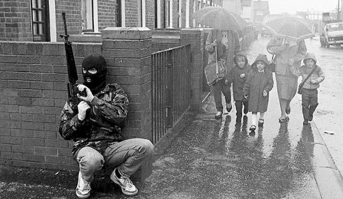
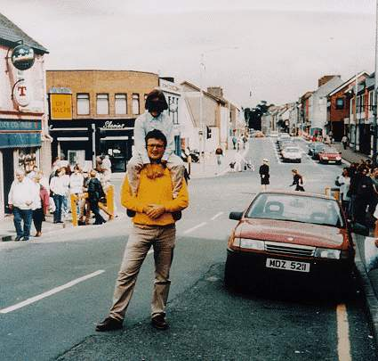

```{r setup, include=FALSE, cache=F, message=F, warning=F, results="hide"}
knitr::opts_chunk$set(cache=TRUE)
knitr::opts_chunk$set(fig.path='figs/')
knitr::opts_chunk$set(cache.path='cache/')

knitr::opts_chunk$set(
                  fig.process = function(x) {
                      x2 = sub('-\\d+([.][a-z]+)$', '\\1', x)
                      if (file.rename(x, x2)) x2 else x
                      }
                  )
```

```{r loadstuff, include=FALSE}
knitr::opts_chunk$set(cache=TRUE)

library(tidyverse)
library(stevemisc)
library(scales)
library(artyfarty)

Ideo <- readxl::read_xlsx("~/Dropbox/data/gtd/globalterrorismdb_USideology_1970-2016.xlsx")

# GTD16 <- readxl::read_xlsx("~/Dropbox/data/gtd/20160629-download/globalterrorismdb_0616dist.xlsx")
# GTD <- readxl::read_xlsx("~/Dropbox/data/gtd/20180730-download/globalterrorismdb_0718dist.xlsx")
GTD <- readxl::read_xlsx("~/Dropbox/data/gtd/globalterrorismdb_0919dist.xlsx")
GTD93 <- readxl::read_xlsx("~/Dropbox/data/gtd/gtd1993_0919dist.xlsx")

GTD %>% filter(country_txt == "United States") %>%
  select(country_txt, eventid:iday, nkill, nwound) %>%
  bind_rows(., GTD93 %>% filter(country_txt == "United States")  %>%
  select(country_txt, eventid:iday, nkill, nwound)) %>%
  arrange(iyear, imonth, iday) -> GTDUS

```


# Introduction
### Puzzle(s) for Today

*Terrorism, like civil war, happens when a government and domestic non-state actor fail to peacefully bargain over differences. What explains when that happens? What can we do about it?*

### An IRA Foot Soldier Patrols West Belfast in 1987



###

```{r usa-terror-incidents-1970-present, echo=F, eval=T, message=F, error=F, warning=F, fig.width = 14, fig.height = 8.5}


GTDUS %>%
  rename(year = iyear) %>%
  mutate(nkill = ifelse(is.na(nkill), 1, nkill),
         nwound = ifelse(is.na(nwound), 1, nwound)) %>%
  group_by(year) %>%
  summarize(nkill = sum(nkill),
            nwound = sum(nwound),
            total = nkill + nwound,
            num = n()) %>%
  ungroup() %>%
  mutate(median = median(num)) %>%
  select(year, total, num) %>%
  ggplot(.,aes(year, num)) + theme_steve_web() + 
  geom_hline(yintercept = 42, linetype="dashed") +
  geom_line(size=1.1, color="#f8766d") +
  geom_ribbon(aes(ymin=0, ymax=num),
              alpha=0.3, fill="#f8766d") +
  xlab("") + ylab("Number of Terror Incidents") +
  scale_x_continuous(breaks = seq(1970, 2020, by = 5)) +
  labs(title = "There's a Median of About 40 Terror Incidents in a Given Year in the United States",
       subtitle = "The peak for terror incidents is the first year in the data (1970), with a reported 468 incidents. These were mostly perpetrated by left-wing radical groups like the Weathermen.",
       caption = "Data: Global Terrorism Database. Horizontal line communicates the median number of incidents in a year in the data.")
  

```

###

```{r usa-terrorism-ideologies-2012-2016, echo=F, eval=T, message=F, error=F, warning=F, fig.width = 14, fig.height = 8.5}

Ideo %>%
  drop_na() %>%
  mutate(year = stringr::str_sub(eventid, 1, 4),
         year = as.numeric(year)) %>%
  rename(Environmental = ENVIRONMENTAL,
         `Left-Wing` = `LEFT-WING`,
         `Right-Wing` = `RIGHT-WING`,
         Religious = RELIGIOUS,
         Christian = `RELIGIOUS-CHRISTIAN`,
         Islamic = `RELIGIOUS-ISLAMIC`) %>%
  select(year, Environmental, `Left-Wing`,
         `Right-Wing`, `Religious`, `Christian`, `Islamic`) %>%
  group_by(year) %>%
  summarize_all(sum) %>%
  gather(Category, num, Environmental:Islamic) -> Ideos

Ideos %>% 
  filter(year >= 2012 & Category != "Religious") %>%
  group_by(Category) %>%
  summarize(n = sum(num)) %>%
  ggplot(.,aes(Category, n)) + 
  theme_steve_web() +
  geom_bar(stat = "identity", color="black", alpha = 0.8, fill="#619cff") +
  geom_text(aes(label=n), vjust=-.5, colour="black", family="Open Sans",
            position=position_dodge(.9), size=4) +
  ylab("Number of Terror Attacks by U.S. Ideologues") +
  labs(title = "Terror Attacks in the U.S. by Ideology, 2012-2016",
       subtitle = "There were 66% more terror attacks committed by right-wing ideologues than Islamists in the five most recent years of the GTD data.",
       caption = "Data: Ideological Motivations of Terrorism in the United States, 1970—2016, GTD Auxiliary Dataset")

```

###

```{r usa-terrorism-ideologies-left-right-1970-2016, echo=F, eval=T, message=F, error=F, warning=F, fig.width = 14, fig.height = 8.5}

Ideos %>%
  filter(Category %in% c("Left-Wing", "Right-Wing")) %>%
  ggplot(.,aes(year,num, color=Category, linetype=Category)) + 
  theme_steve_web() +
  geom_line(size=1.1) +
  scale_x_continuous(breaks = seq(1970, 2015, by = 5)) +
  scale_color_manual(values = pal("five38")) +
  xlab("Year") + ylab("Number of U.S. Terror Attacks by Ideologues") +
  labs(title = "Terror Attacks by Left-Wing and Right-Wing Ideologues, 1970-2016",
       subtitle = "Right-wing terrorism outnumbers left-wing terrorism 9/1 in the two most recent years (2/1 over the past 10), but left-wing terrorism dominated the early 1970s.",
       caption = "Data: Ideological Motivations of Terrorism in the United States, 1970—2016, GTD Auxiliary Dataset")

```

###

```{r usa-terrorism-ideologies-christian-islamic-1970-2016, echo=F, eval=T, message=F, error=F, warning=F, fig.width = 14, fig.height = 8.5}

Ideos %>%
  filter(Category %in% c("Christian", "Islamic")) %>%
  ggplot(.,aes(year,num, color=Category, linetype=Category, fill=Category)) + 
  theme_steve_web() + geom_line(size=1.1) +
  scale_x_continuous(breaks = seq(1970, 2015, by = 5)) +
  scale_color_manual(values = pal("five38")) +
  xlab("Year") + ylab("Number of U.S. Terror Attacks by Ideologues") +
  labs(title = "Terror Attacks by Christian and Islamic Ideologues, 1970-2016",
       subtitle = "Islamic terrorism outnumbers Christian terrorism 3.5/1 since 2001, but Christian terrorists have committed more than twice as many attacks than Islamists since 1970.",
       caption = "Data: Ideological Motivations of Terrorism in the United States, 1970—2016, GTD Auxiliary Dataset")

```


###

```{r usa-terror-casualties-1970-present, echo=F, eval=T, message=F, error=F, warning=F, fig.width = 14, fig.height = 8.5}
GTDUS %>%
  filter(country_txt == "United States") %>%
  rename(year = iyear) %>%
  mutate(nkill = ifelse(is.na(nkill), 1, nkill),
         nwound = ifelse(is.na(nwound), 1, nwound)) %>%
  group_by(year) %>%
  summarize(nkill = sum(nkill),
            nwound = sum(nwound),
            total = nkill + nwound,
            num = n()) %>%
  ungroup() %>%
  mutate(median = median(total)) %>%
  select(year, total, num, median) %>%
  ggplot(.,aes(year, total)) + theme_steve_web() + 
  geom_line(size=1.1, color="#f8766d") +
  geom_ribbon(aes(ymin=0, ymax=total),
              alpha=0.3, fill="#f8766d") +
  xlab("") + ylab("Number of Terror Casualties") +
  annotate("text", x = 1984, y = 4000,
           label = "Rajneeshee\nbioterror attack\n(1984)", family = "Open Sans", size=3) +
  annotate("text", x = 1996, y = 4000,
           label = "Oklahoma\nCity\nbombing\n(1995)", family = "Open Sans", size=3) +
  annotate("text", x = 1992.5, y = 4000,
           label = "World Trade\nCenter\nbombing\n(1993)", family = "Open Sans", size=3) +
  annotate("text", x = 2001, y = 26500,
           label = "World Trade Center\n(2001)",
           family = "Open Sans", size=3) +
  annotate("text", x = 2013, y = 3500,
           label = "Boston Marathon\nbombing\n(2013)", family = "Open Sans", size=3) +
  annotate("text", x= 2017, y = 5420, family="Open Sans",
           label = "Charlottesville,\nFt. Lauderdale,\nLas Vegas,\nNew York\n(2017)",
           size=3) +
  scale_x_continuous(breaks = seq(1970, 2020, by = 5)) +
  scale_y_continuous(labels = scales::comma) +
  labs(title = "There Are Almost Three Dozen (Median: 35) Casualties Each Year in Terror Incidents in the United States",
       subtitle = "There are obvious peaks with the deadliest year on record being, clearly, 2001.",
       caption = "Data: Global Terrorism Database.\nNOTE: the 9/11 casualty counts look unreasonably high mostly because GTD's newer updates have up-counted casualty estimates based on newer information on who has drawn from the September 11th Victim Compensation Fund.")
```


###

```{r usa-drunk-driving-terror-suicide-data-1970-present, echo=F, eval=T, message=F, error=F, warning=F, fig.width = 14, fig.height = 8.5}

DST %>%
  ggplot(., aes(year, ddfat)) + theme_steve_web() +
  geom_line(aes(y = ddfat, colour = "Drunk-driving Fatalities"), size = 1.5, linetype="dashed") +
  geom_line(aes(y = terrtotal, colour = "Terrorism Casualties"),  size=1.5) +
  geom_line(aes(y = suicides, colour = "Estimated Suicides"),  size=1.5) +
  xlab("") + ylab("Casualties") +
  scale_x_continuous(breaks=seq(1970, 2020, by=5)) +
  scale_y_continuous(labels = scales::comma) +
  scale_colour_discrete(name="Category") +
  annotate("text", x = 1984, y = 4000,
           label = "Rajneeshee\nbioterror attack\n(1984)", family = "Open Sans", size=3) +
  annotate("text", x = 1996, y = 4000,
           label = "Oklahoma\nCity\nbombing\n(1995)", family = "Open Sans", size=3) +
  annotate("text", x = 1992, y = 4000,
           label = "World Trade\nCenter\nbombing\n(1993)", family = "Open Sans", size=3) +
  annotate("text", x = 2001, y = 26500,
           label = "World Trade Center\n(2001)",
           family = "Open Sans", size=3) +
  annotate("text", x = 2013, y = 3500,
           label = "Boston Marathon\nbombing\n(2013)", family = "Open Sans", size=3) +
  annotate("text", x= 2017, y = 5420, family="Open Sans",
           label = "Charlottesville,\nFt. Lauderdale,\nLas Vegas,\nNew York\n(2017)",
           size=3) +
  theme(legend.position = "bottom") +
  labs(caption="Data: Global Terrorism Database (Terrorism), U.S. Department of Transportation (Drunk-driving), Center for Disease Control (Suicide).
       Note: Terrorism casualties also include the number wounded but not killed. Drunk-driving statistics include just the number killed.\nThe 9/11 casualty counts look unreasonably high mostly because GTD's newer updates have up-counted casualty estimates based on newer information on who has drawn from the September 11th Victim Compensation Fund",
       title="Casualties in the United States from Terrorism, Suicide, and Drunk-driving, 1970-2018",
       subtitle = "Drunk-driving and suicide are more deadly public bads but don't command public attention like terrorism.")


```

### A Definition of Terrorism

We define **terrorism** as:

- premeditated use of violence by individuals or subnational groups to...
- intimidiate a "larger audience" beyond the immediate victims to...
- obtain some objective that is political or social in nature.

Terrorism scholars split hairs further about the perpetrator and immediate victim.

- However, the "larger audience" is the same.

# What We Know About Terrorism
## The Rationality of Terrorism
### Aren't Terrorists "Crazy?"

Common belief about terrorists: they're crazy radicals.

- Terrorists prefer terrorism because they are cruel.
- Therefore: governments should never negotiate with terrorists.

However, terrorists vary by type.

- Declarations of no-negotiation actually precipitates some terrorist acts.

### What Can We Say About the Rationality of Terrorists?

1. Terrorists have views not widely shared by government (i.e. they're "extremists.")
2. The costs of terrorism, especially suicide terrorism, seem larger than benefits.
3. Terrorist attacks appear "random."

### What Can We Say About the Rationality of Terrorists?

The first is true. The second two are not.

1. Terrorists don't have views widely shared by government, hence: terrorism.
2. Cost is subjective. Any goal-oriented, purposive behavior with ranked preferences is rational.
3. Terror attacks aren't random! They cluster in campaigns.

### The Rationality of Terrorism

Terrorists are strategic.

- Terrorist networks choose targets, respond to risk, and adjust to counterterrorist efforts by the government.
- There is no complete explanation of why people become terrorists or suicide bombers.
    - Magnifying the problem: *anyone* can be a terrorist (see: Tamil Tigers)
    - But terrorist networks deploy their forces, including suicide bombers, in strategic ways.

### The Rationale of Terrorism

Even "random" terrorist attacks may be part of a terrorist network’s strategy. 
	
- Terrorists attempt to instill fear into the population they are targeting.
- Random selections make it harder for the population to avoid and adjust to terrorist attacks.

### The Rationale of Terrorism

Importantly, *terrorists have goals.*

- They want policy concessions from a government.


### Terrorists as Weak Actors

But don't misunderstand: terrorists are weak actors.

- Demands are always outsized relative to their domestic support.
- Must rely on asymmetric warfare to avoid direct military confrontation.
- Best strategy: target civilians to raise costs associated with government support.

Terrorist strategy seems to acknowledge this.

- Terrorists operate in sub rosa cells to avoid detection.
- Also hide in sympathetic population.

## Terrorism as Bargaining Failure
### Terrorism as Bargaining Failure

We can understand why terrorism happens within our bargaining framework.

1. Incomplete information
2. Commitment problems
3. Issue indivisibility

### Terrorism from Incomplete Information

Incomplete information is a central feature to the strategic dilemmas of terrorism.

- Terror groups have clear incentives to bluff/misrepresent capabilities.
    - But: terrorists can't "signal" like states can in coercive diplomacy.
- Governments have difficulty infiltrating sub rosa cells.
    - Have even bigger difficulty getting bigger-picture information (i.e. "stovepiping").
    
### Terrorism from Commitment Problems

The same commitment problems in civil war are generalizable to terrorism.

- Terror groups can't commit to controlling radicals.
- Governments can't credibly commit to not abrogating forgiveness.
    - See: Boston College IRA oral history project
- Governments also concerned with related reputation issues.

### Terrorism from Issue Indivisibility

Terrorists may also be making too big a demand.

- e.g. Hamas vis-a-vis Netanyahu's Israel.

## How Terrorists Hope to Win
### Terrorist Strategies

Terrorist strategies generally cluster on four items.

1. Coercion
2. Provocation
3. Spoiling
4. Outbidding

###



## Can Terrorism Be Prevented?
### Can Terrorism Be Prevented?

Short answer: no. Not completely.

### "Accept Random Events" - Hamilton Nolan

> Hillary Clinton promises to “set up an early-warning system, community by community.” Donald Trump promises to ban vast swaths of people from our country altogether. It would be just as effective for them to promise to call upon an enchanted genie to prevent bad things from happening. It would be just as effective for them to offer soothing opium to the public, so that we may forget the Terror that haunts us. There is such a thing as reasonable thinking, and there is such a thing as magical thinking. It is reasonable to take steps to direct law enforcement resources towards real, identifiable, imminent threats. **It is magical thinking to imagine that elected officials can stop an unknown person with an unknown motivation from doing an unknown thing at an unknown date in the future.**

### Okay, Steve: Surely There's Something...

Governments generally have five strategies for preventing terrorism.

1. Deterrence
    - Problem: retaliation may actually be what terrorists want.
2. Preemption
    - Problem: same as above and preemption is even more expensive.
3. Defense
    - Problem: Important, but invites substitutability.
4. Criminalization
    - Problem: mostly reactive. Citizens want preemption.
5. Negotiation/compromise
    - Problem: major bargaining problems and politically difficult ("no negotation with terrorists.")

All have pros and none are perfect.

###

```{r usa-skyjacking-data-1942-present, echo=F, eval=T, message=F, error=F, warning=F, fig.width = 14, fig.height = 8.5}

asn_stats %>%
  ggplot(. , aes(year, hijack)) + theme_steve_web() +
  geom_bar(stat="identity", alpha = .8, fill="#00BFC4", color="black") +
  scale_x_continuous(breaks = seq(1940, 2020, by = 5)) +
  xlab("Year") + ylab("Number of Skyjacking Incidents") +
  ylim(0, 100) +
  labs(caption="Data: Aviation Safety Network.",
       title="The Number of International Skyjackings, 1942-2019",
       subtitle = "Skyjackings were once a favorite tool of terror groups with a peak of 86 incidents in 1969.") +
  annotate("text", x = 1970, y = 95, 
           label = "Sky marshalls\nintroduced/\nHague Convention\n(1970)",
           family = "Open Sans") +
  annotate("text", x = 1975, y = 75,
           label = "Metal detectors\ninstalled\n(1973)",
           family = "Open Sans")


```

###

```{r palestinian-terrorist-strategies-gtd-1970-2015, echo=F, eval=T, message=F, error=F, warning=F, fig.width = 14, fig.height = 8.5}
tribble(~`Attack Type`, ~styear, ~endyear,
        "Hijacking", 1970, 1985,
        "Bombing/Explosion", 1970, 1985) %>%
    rowwise() %>%
  mutate(iyear = list(seq(styear, endyear))) %>%
  unnest() %>% select(`Attack Type`, iyear) -> typeyears

GTD %>% 
  filter(grepl("Pal|Jordan", gname)) %>% 
  filter(attacktype1 == 4 | attacktype1 == 3) %>%
  group_by(iyear, attacktype1) %>%
  summarize(n = n()) %>%
  mutate(`Attack Type` = ifelse(attacktype1 == 4, "Hijacking", "Bombing/Explosion")) %>%
  left_join(typeyears, .) %>%
  mutate(n = ifelse(is.na(n), 0, n)) %>%
  ggplot(.,aes(iyear, n, group=`Attack Type`, color=`Attack Type`,  fill=`Attack Type`)) + 
    theme_steve_web() +
    geom_bar(stat="identity",position="dodge", alpha=0.8, color="black") +
  geom_text(aes(label=n), vjust=-.5, colour="black", family="Open Sans",
            position=position_dodge(.9), size=4) +
  #geom_line(size=1.1) + theme_steve_web() +
  scale_y_continuous(breaks = seq(0, 150, by=25)) +
  scale_x_continuous(breaks = seq(1970, 1985, by = 1)) +
  xlab("") + ylab("Number of Terror Incidents in a Year") +
  labs(title = "Palestinian Terrorists Weren't Deterred by the Hague Convention. They Changed Strategies.",
       subtitle = "Rational decisions are rational but need not solve strategic situations.",
       caption = "Data: Global Terrorism Database. Note: query starts with groups with 'Pal*' or 'Jordan' in their name. This is not exhaustive, but there are no false positives here either.") +
  annotate("text", x = 1970, y = 20, 
           label = "Hague\nConvention\n(1970)",
           family = "Open Sans") +
  annotate("text", x = 1973, y = 20,
           label = "Metal detectors\nappear\n(1973)",
           family = "Open Sans")
```

# Conclusion and Implications
### Conclusion and Implications

Important conclusions about defeating terrorism:

1. Governments have little incentive to implement promises if there's just one terror group.
2. It's not possible to reach a deal with all terrorists.
3. Wiping out terrorism routinely requires support of moderate terror groups.
4. Unless all members of a moderate group are on board with government concessions, hard-line terrorists will see an increase in capabilities.

### Other Implications

There are some other intriguing implications too.

1. Moderate terrorists have an incentive to foster extremists.
2. High-quality counterterrorism increases the probability of all-out victory, but makes it more difficult to negotiate.
3. Moderate terrorists with poor counterterror abilities are unattractive partners.

