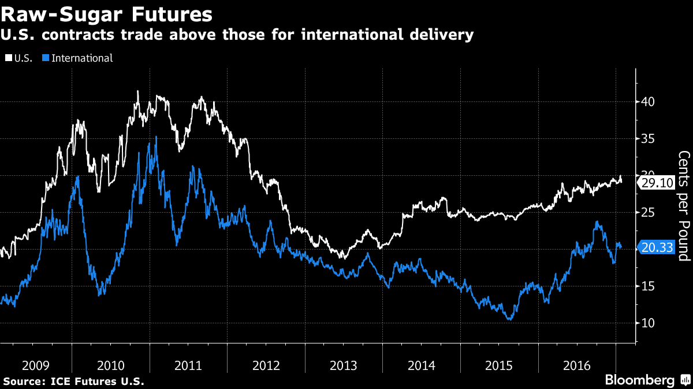
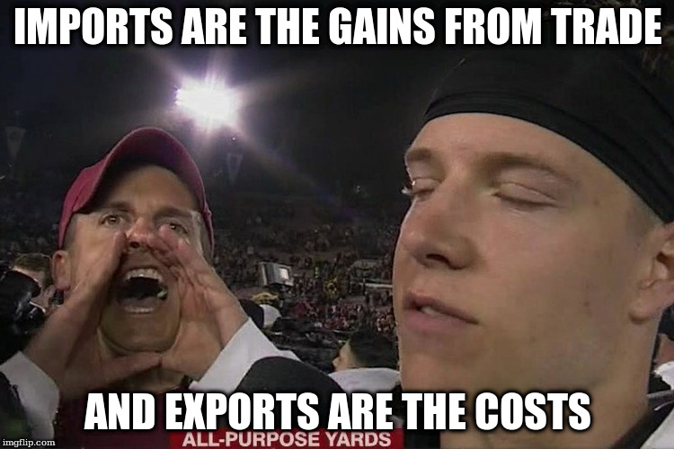
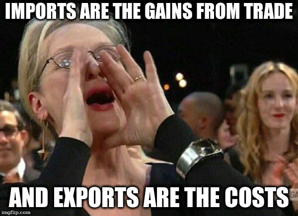
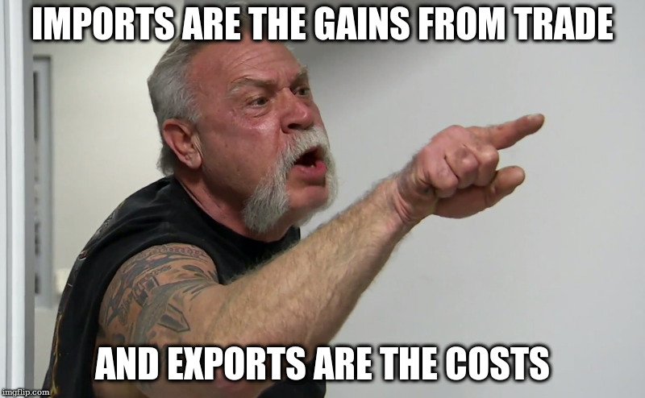
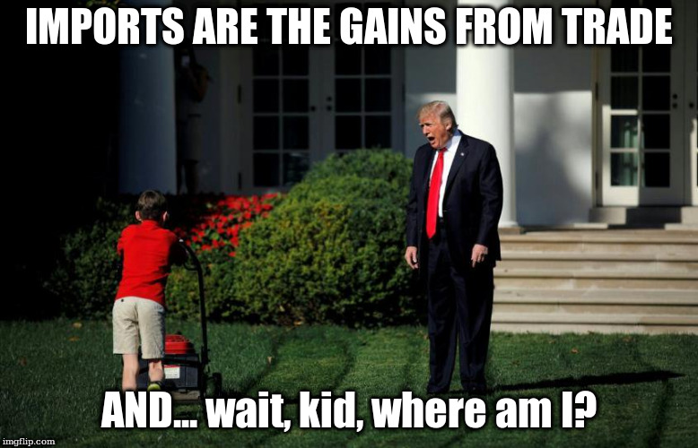
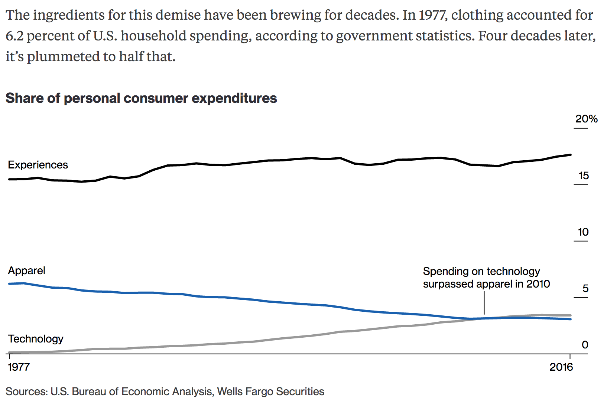

```{r setup, include=FALSE, cache=F, message=F, warning=F, results="hide"}
knitr::opts_chunk$set(cache=TRUE)
knitr::opts_chunk$set(fig.path='figs/')
knitr::opts_chunk$set(cache.path='cache/')

knitr::opts_chunk$set(
                  fig.process = function(x) {
                      x2 = sub('-\\d+([.][a-z]+)$', '\\1', x)
                      if (file.rename(x, x2)) x2 else x
                      }
                  )
```

```{r loadstuff, include=FALSE}
knitr::opts_chunk$set(cache=FALSE)

library(WDI)
library(tidyverse)
library(stevemisc)
library(fredr)
library(artyfarty)

Data <- read.csv("~/Dropbox/projects/mid-project/gml-mid-data/2.1/gml-ndy-2.1.csv") %>% tbl_df()
Cont <- read.csv("~/Dropbox/data/cow/contiguity/3.2/contdird.csv") %>% tbl_df()
Majors <- read.csv("~/Dropbox/data/cow/states/majors2016.csv") %>% tbl_df()
Contcd <- read.csv("~/Dropbox/data/cow/coldepcont/contcold.csv") %>% tbl_df()

Trade <- read.csv("~/Dropbox/data/cow/trade/Dyadic_COW_4.0.csv") %>% tbl_df()

Trade %>% 
  select(ccode1, ccode2, year, smoothtotrade) %>%
  left_join(Data, .) -> Data

Contcd %>%
  rename(ccode1 = statelno, ccode2 = statehno) %>%
  select(ccode1, ccode2, year, land, sea, total) %>%
  left_join(Data, .) -> Data

Cont %>%
  rename(ccode1 = state1no, ccode2 = state2no) %>%
  select(ccode1, ccode2, year, conttype) %>%
  left_join(Data, .) -> Data

Data %>%
  mutate(conttype = ifelse(is.na(conttype), 6, conttype),
         land = ifelse(is.na(land), 0, land),
         sea = ifelse(is.na(sea), 0, sea),
         total = ifelse(is.na( total), 0, total),
         contig = ifelse(conttype == 6 & total == 0, 0, 1),
         # Code regions...
         region1 = NA,
         region1 = ifelse(ccode1 < 200, "Americas", region1),
         region1 = ifelse(ccode1 >= 200 & ccode1 < 400, "Europe", region1),
         region1 = ifelse(ccode1 >= 400 & ccode1 < 600, "Africa", region1),
         region1 = ifelse(ccode1 >= 600 & ccode1 < 700, "ME/NA", region1),
         region1 = ifelse(ccode1 >= 700 & ccode1 < 900, "Asia", region1),
         region1 = ifelse(ccode1 >= 900, "Oceania", region1),
         region2 = NA,
         region2 = ifelse(ccode2 < 200, "Americas", region2),
         region2 = ifelse(ccode2 >= 200 & ccode2 < 400, "Europe", region2),
         region2 = ifelse(ccode2 >= 400 & ccode2 < 600, "Africa", region2),
         region2 = ifelse(ccode2 >= 600 & ccode2 < 700, "ME/NA", region2),
         region2 = ifelse(ccode2 >= 700 & ccode2 < 900, "Asia", region2),
         region2 = ifelse(ccode2 >= 900, "Oceania", region2),
         # Code majors...
         maj1 = NA,
         maj1 = ifelse(ccode1 == 2 & year >= 1898, 1, maj1),
         maj1 = ifelse(ccode1 == 200, 1, maj1),
         maj1 = ifelse(ccode1 == 220 & year <= 1940, 1, maj1),
         maj1 = ifelse(ccode1 == 220 & year >= 1945, 1, maj1),
         maj1 = ifelse(ccode1 == 255 & year <= 1918, 1, maj1),
         maj1 = ifelse(ccode1 == 255 & (year >= 1925 & year <= 1945), 1, maj1),
         maj1 = ifelse(ccode1 == 255 & year >= 1991, 1, maj1),
         maj1 = ifelse(ccode1 == 300 & year <= 1918, 1, maj1),
         maj1 = ifelse(ccode1 == 325 & (year >= 1860 & year <= 1943), 1, maj1),
         maj1 = ifelse(ccode1 == 365 & year <= 1917, 1, maj1),
         maj1 = ifelse(ccode1 == 365 & year >= 1922, 1, maj1),
         maj1 = ifelse(ccode1 == 710 & year >= 1950, 1, maj1),
         maj1 = ifelse(ccode1 == 740 & (year >= 1895 & year <= 1945), 1, maj1),
         maj1 = ifelse(ccode1 == 740 & year >= 1991, 1, maj1),
         maj1 = ifelse(is.na(maj1), 0, maj1),
         maj2 = NA,
         maj2 = ifelse(ccode2 == 2 & year >= 1898, 1, maj2),
         maj2 = ifelse(ccode2 == 200, 1, maj2),
         maj2 = ifelse(ccode2 == 220 & year <= 1940, 1, maj2),
         maj2 = ifelse(ccode2 == 220 & year >= 1945, 1, maj2),
         maj2 = ifelse(ccode2 == 255 & year <= 1918, 1, maj2),
         maj2 = ifelse(ccode2 == 255 & (year >= 1925 & year <= 1945), 1, maj2),
         maj2 = ifelse(ccode2 == 255 & year >= 1991, 1, maj2),
         maj2 = ifelse(ccode2 == 300 & year <= 1918, 1, maj2),
         maj2 = ifelse(ccode2 == 325 & (year >= 1860 & year <= 1943), 1, maj2),
         maj2 = ifelse(ccode2 == 365 & year <= 1917, 1, maj2),
         maj2 = ifelse(ccode2 == 365 & year >= 1922, 1, maj2),
         maj2 = ifelse(ccode2 == 710 & year >= 1950, 1, maj2),
         maj2 = ifelse(ccode2 == 740 & (year >= 1895 & year <= 1945), 1, maj2),
         maj2 = ifelse(ccode2 == 740 & year >= 1991, 1, maj2),
         maj2 = ifelse(is.na(maj2), 0, maj2)) -> Data

Data %>%
  mutate(region = NA,
         region = ifelse(region1 == "Americas" & region2 == "Americas", "Americas", region),
         region = ifelse(region1 == "Europe" & region2 == "Europe", "Europe", region),
         region = ifelse(region1 == "Africa" & region2 == "Africa", "Africa", region),
         region = ifelse(region1 == "ME/NA" & region2 == "ME/NA", "ME/NA", region),
         region = ifelse(region1 == "Asia" & region2 == "Asia", "Asia", region),
         region = ifelse(region1 == "Oceania" & region2 == "Oceania", "Oceania", region),
         prd = NA,
         prd = ifelse(contig == 1 | (maj1 == 1 | maj2 == 1), 1, 0)) -> Data

Data %>%
  filter(prd == 1) %>%
  mutate(dyad = as.numeric(paste0("1",sprintf("%03d", ccode1), 
                                    sprintf("%03d", ccode2))),
         logtrade = ifelse(smoothtotrade < 0, NA, log(smoothtotrade + 1))) -> PRD

PRD <- sbtscs(PRD, midongoing, year, dyad) %>% tbl_df()

require(brglm)
require(splines)
M1 <- brglm(midonset ~ logtrade + bs(spell, 4),
             data=PRD, family=binomial(logit), 
             na.action = na.exclude, method="brglm.fit", pl=TRUE)

newdat <- data.frame(logtrade = seq(min(PRD$logtrade, na.rm=TRUE), max(PRD$logtrade, na.rm=T), by = 0.01),
                     spell = 0)


predict(M1, newdat) -> preds

PRD <- cbind(PRD, pmid = predict(M1,type='response'))

  


```


# Introduction
### Puzzle(s) for Today

*Free trade creates abundance and is a force for peace. So why limit it?*

<!-- ###

 -->

<!-- ###

 -->

###

```{r price-of-sugar-usa-world-1980-2018, fig.height=8.5, fig.width = 14, echo=F, eval = T, message =F, warning = F}

fredr(series_id = "PSUGAISAUSDM",
                      observation_start = as.Date("1980-01-01")) %>%
  mutate(series_id = "Global") -> SugG

fredr(series_id = "PSUGAEECUSDM",
                      observation_start = as.Date("1980-01-01")) %>%
  mutate(series_id = "Europe") -> SugE

fredr(series_id = "PSUGAUSAUSDM",
                      observation_start = as.Date("1980-01-01")) %>%
  mutate(series_id = "United States") -> SugA

bind_rows(SugA, SugG) %>%
  rename(`Price of Sugar` = series_id) %>%
   ggplot(.,aes(date, value, color=`Price of Sugar`,linetype=`Price of Sugar`)) + theme_steve_web() +
  geom_line(size = 1.1) +
  scale_color_manual(values = pal("xmen"),
                     name = "Price of Sugar") +
  scale_linetype_discrete(name = "Price of Sugar") +
  scale_x_date(date_breaks = "2 years",
               date_labels = "%Y") +
  ylab("Price of Sugar (in U.S. cents pound, nominal/NSA)") + xlab("") +
  labs(title = "Americans Pay More for Sugar Than the Rest of the World",
       subtitle = "This isn't a ''sweet tax.'' Rather, the culprit is sugar protectionism policies dating to the Great Depression that make sugar trade above the price for international delivery.",
       caption = "Data: International Monetary Fund, via the Federal Reserve Bank of St. Louis")

```

###

```{r price-of-sugar-usa-europe-world-1980-2018, fig.height=8.5, fig.width = 14, echo=F, eval = T, message =F, warning = F}

bind_rows(SugA, SugG, SugE) %>%
  mutate(series_id = forcats::fct_relevel(series_id, "Global", "United States", "Europe")) %>%
  rename(`Price of Sugar` = series_id) %>%
  filter(date > "1990-12-01") %>%
  ggplot(.,aes(date, value, group=`Price of Sugar`, color=`Price of Sugar`,linetype=`Price of Sugar`)) + theme_steve_web() +
  geom_line(size = 1.1) +
  scale_x_date(date_breaks = "2 years",
               date_labels = "%Y") +
    scale_color_manual(values = pal("xmen"),
                     name = "Price of Sugar") +
  scale_linetype_discrete(name = "Price of Sugar") +
  ylab("Price of Sugar (in U.S. cents pound, nominal/NSA)") + xlab("") +
   labs(title = "Americans Pay More for Sugar Than the Rest of the World (Even Europe)",
       subtitle = "Again, this isn't a ''sweet tax.'' It's sugar protectionism policies dating to the Great Depression that make sugar more expensive in the U.S.",
       caption = "Data: International Monetary Fund, via the Federal Reserve Bank of St. Louis")

```

### Sugar Protectionism in the U.S.

Sugar beet and sugarcane farms account for about 1/5th of 1% of U.S. farms.

- Sugar itself accounts for about 1.3% of all farm and livestock production.

Yet:

- Sugar is about 33% of all campaign donations from the crop industry.
    - Also about 40% of all industry lobbying expenditures.
- Import limits stem from 1934 Sugar Act (and were supposed to be temporary).
    - Later extended with 1977 Food and Agriculture Act and 2002 farm bill


### Effects of Sugar Protectionism

The effects of sugar protectionism are multiple, and all bad.

- Since 2000, Americans have paid, on average, 79% more for raw sugar and 87% for refined sugar compared to the world price.
- *Extends to U.S. territories as well.* 
    - It's why Hawaii started screaming for statehood.
    - Also a major reason why Puerto Rico started struggling in the 1960s.
    
Put another way, the U.S. government exchanged Puerto Rico's prosperity for Louisiana's prosperity and the island has been paying for it since.
    
### Effects of Sugar Protectionism


Major (but subtle) cost to sugar protectionism: substitution into high-fructose corn syrup.

- Which is also absurdly cheap because of corn subsidies.

Want to understand why PR's economy has been in dire straits since the 1960s? And why we're getting collectively getting fatter and sicker? 

- Look at sugar protectionism as a public bad for one reason why.

We'd all be better off (in more ways than one) if we could freely trade sugar without coddling the sugar industry.

# Why Trade? And Why Protect from Trade?
## The Benefits of Trade
### What's So Good About Trade?

In a word, everything.

### Why Trade?

For producers:

- Sell to new markets, expand business
- Increase efficiency

For consumers:

- Cheaper, more varied goods
    - Seriously, don't pretend like you don't shop at Walmart...
    
For people like me:

- IR scholars have found a robust connection between trade and peace.
- More interconnected states are less likely to fight.

###

```{r trade-mids-1870-2010, fig.height=8.5, fig.width = 14, echo=F, eval = T, message =F, warning = F}

range01 <- function(x, ...){(x - min(x, ...)) / (max(x, ...) - min(x, ...))}

PRD %>%
  group_by(year) %>%
  filter(year > 1869) %>%
  summarize(pmid = mean(midongoing, na.rm=T),
            meantrade = mean(logtrade, na.rm=T),
            rmeantrade = (meantrade - min(meantrade))/(max(meantrade) - min(meantrade))) %>%
  ggplot(.,aes(x = year)) +
  geom_line(aes(y = pmid, color = "Proportion of States in a MID"), size=1.1) +
  geom_line(aes(y = meantrade/6, color = "Total Volume of Trade (Logged)"), 
            size=1.1) + 
  scale_y_continuous(sec.axis = sec_axis(~.*6, name = "Average Total Volume of Trade in the World (Logged)")) +
  theme_steve_web() + ylab("Proportion of States in a MID") + xlab("") +
  scale_x_continuous(breaks=seq(1870, 2010, by = 5)) +
  scale_color_manual(values = pal("five38")) +
  labs(colour = "Category",
       title = "IR Scholars Generally See Trade as Conducive to Global Peace",
       subtitle = "The argument is intuitive; interconnected states see conflict as too costly and an unnecessary disruption of commerce.",
       caption = "Data: Correlates of War Dyadic Trade Data (v. 4.0) and Gibler-Miller-Little MID Data (v. 2.1)")

```


### Why Trade?

(Free) trade follows specialization and division of labor.
    
### Comparative Advantage

Let's go to Ricardo's famous model on the benefits of free trade.

- Assume only two countries: England and Portugal.
- Assume just two goods (of identical quality): cloth and wine

For simplicity's sake, let's reduce measurements to work-hours for one "unit."

###

| **Country** | **Work-Hours for Cloth** | **Work-Hours for Wine** |
|:--------|:--------------------:|:-------------------:|
| *England* | 100 | 120 |
| *Portugal* | 90 | 80 |

Table: Hours of Work Necessary to Produce One Unit (Ricardo's Example)

### Absolute and Comparative Advantage

Notice: Portugal is the more efficient country.

- It requires fewer hours to produce cloth (90 to 100)
- It requires fewer hours to produce wine (80 to 120)

We say Portugal has an **absolute advantage** over England in the production of both.

### Absolute and Comparative Advantage

However, England has unique advantage in the production of cloth.

- 100 work-hours gets England a unit of cloth of 5/6ths a unit of wine.
- 90 work-hours gets Portugal a unit of cloth and 1 and 1/8ths a unit of wine.

Portugal has an absolute advantage (i.e. fewer work-hours) but England has a **comparative advantage** (i.e. a lower opportunity cost).

### Why Not Specialize and Trade?

Under **autarky**, 220 (170) total work-hours gets England (Portugal) a unit of each. However:

- Portugal is more efficient at producing wine than cloth.
- England is more efficient at producing cloth than wine.

If they were to specialize in their comparative advantages:

- Portugal could produce 2.125 units of wine.
- England could produce 2.2 units of cloth.

If they were to liberalize their trade, both would produce and consume more of both than they could under autarky.


### A Difficult "Sell"

Economic logic stood at odds with mercantilist policies.

- Government policies that reduce imports compromise efficiency.
- Exports are fine but they're not the only metric for evaluating trade.

Indeed: *imports are the gains from trade while exports are its costs.*

###



###



###




###



###

- Imports allow countries to focus production on its strengths.
- *Remember this the next time you hear some politician talk about the "trade deficit."*


## Why Do Countries Trade What They Do?
### How Do We Know a Comparative Advantage?

It's tough to know what a country does best.

- We could look at exports, but then we've understood it by tautology.

**Heckscher-Ohlin trade theory** provides a useful answer.

### Heckscher-Ohlin Trade Theory

A country will export goods that make intensive use of the factors of production in which it is well-endowed. Factors include:

- Land (essential to agriculture)
- Labor (usually: unskilled labor)
- Capital (referring to machinery and financial assets to operate machinery)
- Human capital (skilled labor)

### Heckscher-Ohlin Trade Theory

Example of countries exporting what they're good at:

- 19th century U.S. (tobacco, cotton, wheat)
- Current U.S. (capital-intensive machinery)
- Bangladesh (huge low-skilled labor population)

###

```{r usa-can-mex-high-tech-esports-1990-2016, echo=F, eval=T, fig.width = 14, fig.height = 8.5, warning = F, message = F}
WDI(country = c("US", "CA", "MX"), indicator = c("TX.VAL.TECH.CD", "TX.VAL.MRCH.CD.WT"),
    start = 1960, end = 2017, extra = FALSE, cache = NULL) %>%
  rename(merchexp = `TX.VAL.MRCH.CD.WT`,
         techexp = `TX.VAL.TECH.CD`)  %>%
  mutate(techexp = (techexp/1000000),
         #country = ifelse(iso2c == "BD" | iso2c == "PK", "Bangladesh and Pakistan", country),
         Country = country) %>%
  filter(year > 1989) %>%
  ggplot(.,aes(year, techexp, group = Country, color=Country, linetype = Country)) + 
  theme_steve_web() +
  geom_line(size=1.1) + 
  scale_y_continuous(labels = scales::dollar) +
  # scale_color_manual(values = pal("xmen")) +
  labs(caption = "Data: United Nations, Comtrade Data via World Bank Development Indicators",
       title = "The U.S. Exports About Three Times as Much in High-Technology Goods than Canada and Mexico",
       subtitle = "This would square with casual observations that the U.S. is better endowed in capital than its NAFTA neighbors.") +
  scale_x_continuous(breaks = seq(1990, 2016, by = 2)) +
  ylab("Value of High-Tech Exports in Millions of Current USD") + xlab("")
```

###

```{r where-do-usa-clothes-come-from, echo=F, eval=T, fig.width = 14, fig.height = 8.5, warning = F, message = F}

tribble(
  ~Country, ~value,
  "China", 44.60,
  "Vietnam", 11.28,
  "India", 7.98,
  "Bangladesh", 5.70,
  "Indonesia", 5.41,
  "Mexico", 5.40,
  "Pakistan", 3.19,
  "Honduras", 2.87,
  "Cambodia", 2.60,
  "Sri Lanka", 2.19
) %>%
  ggplot(.,aes(reorder(Country, -value), value)) + 
  geom_bar(stat="identity", alpha = 0.8, color="black", fill = "#619cff") +
  theme_steve_web() +
  geom_text(aes(label=value), vjust=-.5, colour="black",
            position=position_dodge(.9), size=3.5,
            family = "Open Sans") +
  xlab("Country") + ylab("Value of Imports (in Billion USD)") +
  labs(title = "Where Do Your Clothes Come From?",
       subtitle = "Textile/clothing imports in the U.S. come from countries with large, low-skilled labor populations. This is consistent with Heckscher-Ohlin theory.",
       caption = "Data: World Integrated Trade Solution, World Bank. Year: 2015.")

```


<!--
### "The Death of Clothing"



-->

###

```{r death-of-clothing-1930-2017, echo=F, eval=T, fig.width = 14, fig.height = 8.5, warning = F, message = F}
PCE <- fredr(series_id = "PCECA",
                    observation_start = as.Date("1930-01-01")) %>%
  rename(PCE = value) %>% select(-series_id)

Clothes <- fredr(series_id = "DCAFRC1A027NBEA",
                        observation_start = as.Date("1930-01-01")) %>%
  rename(Clothes = value) %>% select(-series_id)

Rec <- fredr(series_id = "DRCARC1A027NBEA",
             observation_start = as.Date("1930-01-01")) %>%
  rename(Recreation = value) %>% select(-series_id)

Food <- fredr(series_id = "DFXARC1A027NBEA",
                     observation_start = as.Date("1930-01-01")) %>% 
  rename(Food = value) %>% select(-series_id)

left_join(PCE, Clothes) %>%
  left_join(., Rec) %>%
  left_join(., Food) %>%
  mutate(Clothes = Clothes/PCE,
         Recreation = Recreation/PCE,
         Food = Food/PCE) %>%
  group_by(date) %>%
  gather(Category, Value, Clothes:ncol(.)) %>%
  ggplot(.,aes(date, Value, color=Category, linetype=Category)) +
  theme_steve_web() +
  geom_line(size=1.1) +
  scale_color_manual(values = pal("xmen")) +
  scale_x_date(date_breaks = "5 years",
               date_labels = "%Y") +
  scale_y_continuous(labels = scales::percent) +
  xlab("") + ylab("Percentage of Personal Consumption Expenditures") +
  labs(title = "''The Death of Clothing''",
       subtitle = "The apparel industry isn't 'dying', though free trade has played one role in why clothes (and food) are cheaper and a lower percentage of personal expenditures over time.",
       caption = "Data: Bureau of Economic Analysis. Source/inspiration: https://www.bloomberg.com/graphics/2018-death-of-clothing/
       Now, if you want a real laugh, add in personal consumption expenditures for rent and health care and see what happens...")

```

###

```{r steves-clothes-2019, echo=F, eval=T, fig.width = 14, fig.height = 8.5, warning = F, message = F}
data("steves_clothes")

steves_clothes %>%
  group_by(origin, type) %>% summarize(ntype = n()) %>%
  group_by(origin) %>% mutate(n = sum(ntype)) %>%
  rename(Type = type) %>%
  ggplot(.,aes(reorder(origin, -n), ntype)) + theme_steve_web() + 
  geom_bar(stat="identity",aes(fill=Type), color="black") +
  scale_fill_manual(values = pal("five38")) +
  xlab("Country of Origin") + ylab("Number of Articles of Clothing in Steve's Closet") +
  labs(title = "Where Do Steve's Clothes Come From?",
       subtitle = "There are more than 3,000 garment manufacturers in Indonesia, a country disproportionately responsible for my professional attire (and probably yours too).",
caption = "Data: Steve's closet as of Feb. 21, 2019. If you must know, I'm mostly shopping at prominent clothing retailers like Belk, JC Penney, and Kohl's. In that regard, I think I'm typical.")
```

###

```{r usa-exports-2016, echo=F, eval=T, fig.width = 14, fig.height = 8.5, warning = F, message = F}
tribble(
  ~type, ~value,
  #--|--
  "Capital Goods", 514,
  "Industrial Supplies", 398,
  "Consumer Goods", 194,
  "Automobiles", 150,
  "Foods, Feeds,\nBeverages", 131,
  "Travel Services", 293,
  "Computer/Business\nServices", 178,
  "Royalty/License Fees", 120,
  "Financial Services", 120,
  "Government/Military\nContracts", 20
) %>%
  ggplot(.,aes(type, value)) + theme_steve_web() +
  geom_bar(stat="identity", alpha = 0.8, color="black", fill = "#619cff") +
  geom_text(aes(label=value), vjust=-.5, colour="black",
            position=position_dodge(.9), size=3.5,
            family = "Open Sans") +
  ylab("Value of Exports (in Billions)") + xlab("Export Category") +
  labs(caption = "Data: U.S. Census",
       title= "The U.S. Exported About $2.2 Trillion USD in Goods and Services in 2016",
       subtitle = "Capital goods (e.g. commercial aircraft [$121 billion], industrial machines [$51 billion], semiconductors [$44 billion], and telecommunications [$41 billion]) lead among all export types.")

```


## Why Do Countries Put Up Barriers to Trade?
### Why Do Countries Put Up Barriers to Trade?

The world is more interconnected now than ever before. Trade is freer as well.

- However, this is the exception and not the historical rule.


Countries have used/still use various tools reduce imports.

- Tariffs
- Quantitative restrictions (i.e. quotas)
- Non-tariff barriers (e.g. regulations)


### Historical Patterns

Openness to trade has varied substantially over time.

- Over 300 years of mercantilism after the discovery of the Americas.
- Increase in trade followed height of Pax Britannica.
    - U.S. was noteworthy exception here.
- World wars and the Great Depression made protectionism the norm again.

One such reason why the U.S. has led the charge for liberalizing trade worldwide.

###

```{r usa-trade-gdp-1960-2016, echo=F, eval=T, fig.width = 14, fig.height = 8.5, warning = F, message = F}
WDI(country = "US", indicator = "NE.TRD.GNFS.ZS",
    start = 1960, end = 2018, extra = FALSE, cache = NULL) %>%
  rename(tradegdp = `NE.TRD.GNFS.ZS`) -> ustrade

# ustrade %>%
#   mutate(tradegdp = ifelse(year == 2017, ((1546273.0+2341962)/19485400)*100, tradegdp),
#          tradegdp = ifelse(year == 2018, ((1537148.6+2326524.5)/20513000)*100, tradegdp)) -> ustrade

ustrade %>%
  ggplot(.,aes(year,tradegdp)) + theme_steve_web() +
  geom_line(size=1.1) +
  geom_ribbon(aes(ymin=0, ymax=tradegdp),
              alpha=0.3, fill="#619CFF") +
  ylab("Trade as % of GDP") + xlab("Year") +
  scale_x_continuous(breaks=seq(1960, 2016, by=5)) + xlab("") +
  labs(caption = "Data: World Bank Development Indicators (1960-2016).",
       title="Trade as a Percentage of U.S. GDP, 1960-2016",
       subtitle="Trade has become an increasingly large part of the U.S. economy since the 1960s.")
```


###
```{r usa-trade-gdp-1790-2018, echo=F, eval=T, fig.width = 14, fig.height = 8.5, warning = F, message = F}

ustradegdp %>%
  mutate(tradegdp = (impo + expo)/gdpb) %>%
  ggplot(.,aes(year,tradegdp)) + geom_line(size = 1.1) + theme_steve_web() +
  geom_ribbon(aes(ymin=0, ymax=tradegdp),
              alpha=0.3, fill="#619CFF") +
  scale_x_continuous(breaks=seq(1790, 2020, by = 10)) +
  scale_y_continuous(labels = scales::percent) +
  xlab("") + ylab("Trade as % of GDP") +
  labs(title = "The Volume of Trade as Percentage of GDP in the United States, 1790-2018",
       subtitle = "Trade's importance to the U.S. economy has major variation over time, especially early into the country's independence from Great Britain.",
       caption = "Data: Various sources (see especially: http://www.econdataus.com/tradeall.html).\nPost-1960 data come from the World Bank. 2017 and 2018 observations are armchair calculations from U.S. Census Bureau (trade) and IMF (GDP).")

```

### Why Do Countries Put Up Barriers to Trade?

Domestic politics, really.

- Free trade creates diffuse benefits but sometimes concentrates costs.

### Who Benefits from Protectionism?

- National producers
- Scarce factors (see: **Stolper-Samuelson Theorem**)
- Specific industries (see: **Ricardo-Viner Theorem**)

### Who Loses from Protectionism?

- You
- Also: exporters (who fear reprisal)

# Conclusion
### Conclusion

*Free trade is good*.

- Free trade follows logic of comparative advantage.
- It creates abundance unavailable under autarky/mercantilist policies.
- *Imports are actually gains from trade, and not losses*.

However, trade, like any policy, creates winners and losers.

- Problem: benefits are diffuse but costs can be concentrated.
- Protectionism is a public bad, but it's more the norm than free trade (historically).