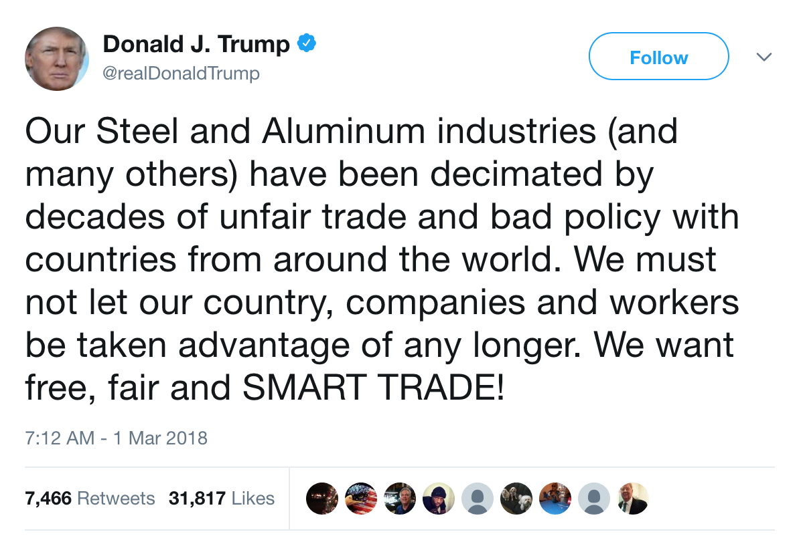
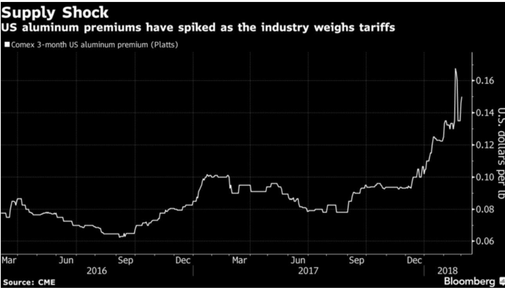
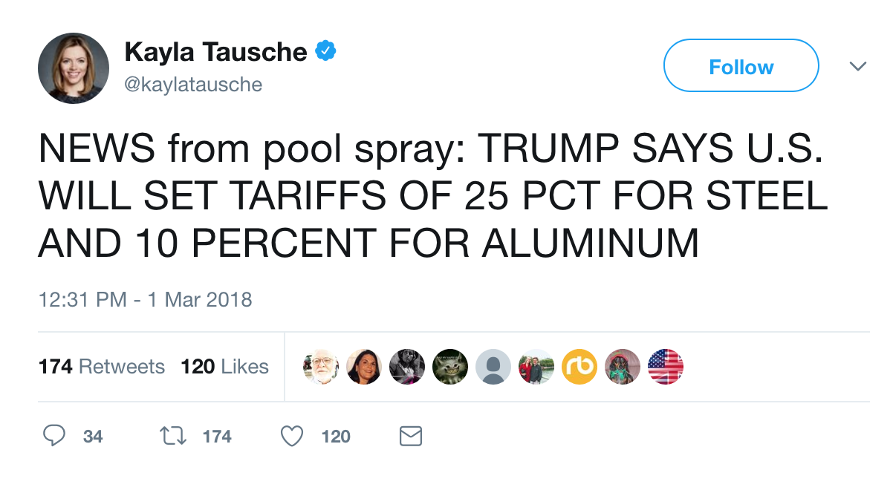
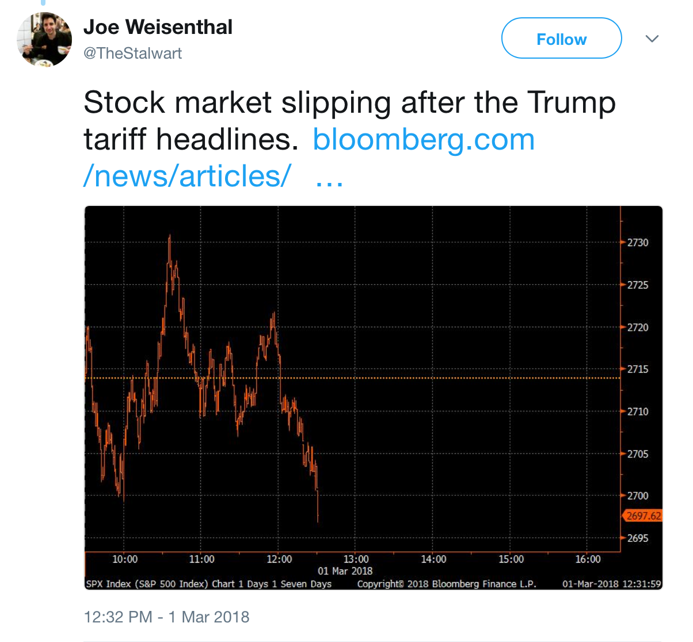
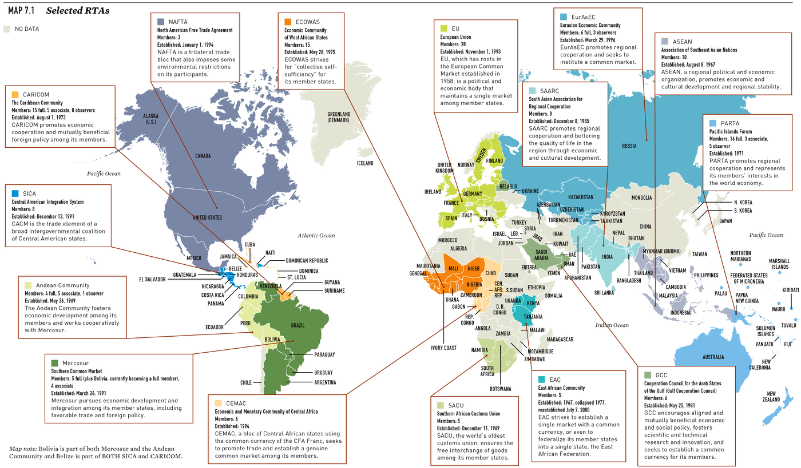
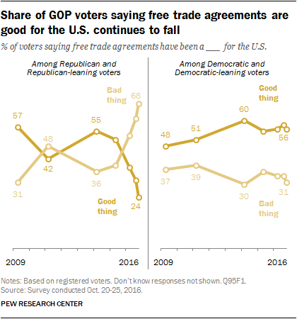

```{r setup, include=FALSE, cache=F, message=F, warning=F, results="hide"}
knitr::opts_chunk$set(cache=TRUE)
knitr::opts_chunk$set(fig.path='figs/')
knitr::opts_chunk$set(cache.path='cache/')

knitr::opts_chunk$set(
                  fig.process = function(x) {
                      x2 = sub('-\\d+([.][a-z]+)$', '\\1', x)
                      if (file.rename(x, x2)) x2 else x
                      }
                  )
```

```{r loadstuff, include=FALSE}
knitr::opts_chunk$set(cache=FALSE)

library(WDI)
library(tidyverse)
library(stevemisc)
library(car)
# library(maddison)
library(artyfarty)
library(fredr)
library(lubridate)

Alumfutures <- readxl::read_xlsx("~/Dropbox/teaching/posc1020/trade-2/aluminum-futures.xlsx")  %>% mutate(date = mdy(date))
```


# Introduction
### Puzzle(s) for Today

*Trade is akin to a prisoner's dilemma. How does it happen despite "cheating" as a dominant strategy?*

### Ugh...



###


###



```{r aluminum-futures-2018, echo=F, eval=F, fig.width = 14, fig.height = 8.5, warning = F, message = F}
Alumfutures %>%
  ggplot(.,aes(date, price)) + theme_steve_web() +
  scale_x_date(date_labels = "%b", date_breaks = "1 month") +
  geom_line(size=1.1)
 
```

###

```{r industrial-production-us-steel-1972-present, echo=F, eval=T, fig.width = 14, fig.height = 8.5, warning = F, message = F}

Steel <- fredr(series_id = "IPN3311A2RS",
                      observation_start = as.Date("1972-01-01")) %>%
  mutate(series_id = "Steel")

Alum <- fredr(series_id = "IPG3313S",
                      observation_start = as.Date("1972-01-01"))  %>%
  mutate(series_id = "Alumina/Aluminum")

bind_rows(Steel, Alum) %>%
  rename(Production = series_id) %>%
  ggplot(.,aes(date, value, color=Production, linetype=Production)) + theme_steve_web() +
  geom_line(size=1.1) +
  scale_color_manual(values = pal("five38")) +
   scale_x_date(date_labels = "%Y", 
                breaks = seq(as.Date("1972-01-01"), as.Date("2018-12-31"), by="2 years")) +
  ylab("Industrial Production (Index: 2012 = 100)") +
  xlab("Date") +
  annotate("rect", xmin=as.Date("1973-11-01"), xmax=as.Date("1975-01-01"),
           ymin=0, ymax=Inf, alpha=0.4) +
  annotate("rect", xmin=as.Date("1980-01-01"), xmax=as.Date("1980-06-01"),
           ymin=0, ymax=Inf, alpha=0.4) +
  annotate("rect", xmin=as.Date("1981-07-01"), xmax=as.Date("1982-11-01"),
           ymin=0, ymax=Inf, alpha=0.4) +
  annotate("rect", xmin=as.Date("1990-07-01"), xmax=as.Date("1991-03-01"),
           ymin=0, ymax=Inf, alpha=0.4) +
  annotate("rect", xmin=as.Date("2001-03-01"), xmax=as.Date("2001-11-01"),
           ymin=0, ymax=Inf, alpha=0.4) +
  annotate("rect", xmin=as.Date("2007-12-01"), xmax=as.Date("2009-05-01"),
           ymin=0, ymax=Inf, alpha=0.4)  +
  labs(title = "Aluminum and Steel Aren't Exactly Industries in Crisis",
       subtitle = "If you can see where the 'decimation' has happened in aluminum and steel production in the past 30 years, feel free to speak up.",
       caption = "Data: Board of Governors of the Federal Reserve System")

  

```

### UPDATE: Oh for the love of...



###



###


### "They Keep Coming to the Table, Always Bitching and Complaining"


### The U.S.-Brazil Cotton Dispute

Trade scholars find this dispute to be a hilarious illustration of the strategic problem of trade. Background:

- Cotton farmers get around $4-billion in subsidies and income protection from the U.S. (i.e. STAX)
    - These include farms in almost all southern-half states from California to Florida.
- Brazil, which has a huge cotton-export industry (5th-largest in the world), contended this is an unfair advantage (and it is).


Brazil filed a case against the U.S. in the WTO and won in 2004.

- However, the U.S. had not done anything to accommodate Brazil or the WTO in the seven years after that decision.


### The U.S.-Brazil Cotton Dispute

Brazil decided it needed to go "nuclear" in retaliating.

- WTO rules let the winning country (i.e. Brazil) tax imports from the losing country.
- Brazil listed 102 products it was going to levy with an import tax and let those industry reps know they had 30 days to force the U.S. hand.

Exporters in the U.S. (predominantly shoe-manufacturers and wheat-growers) pressured the U.S. hard.

- However, STAX is a tricky program to eliminate.

### The U.S.-Brazil Cotton Dispute

The compromise: U.S. wouldn't drop STAX (but did tweak farm bill afterward), but convinced Brazil to drop its lawsuit after a $150-million-a-year settlement.

- In other words, American consumers are now "double-taxed" on cotton.

However, Brazil got something in return.

# How Do Countries Get What They Want in Trade?
###  How Do Countries Get What They Want?

Trade protectionism is largely driven by domestic concerns.

- Certainly countries can open or close their borders regardless of the action of others.

Still: trade is fundamentally a strategic problem.

- Countries condition mutually beneficial trade based on reciprocity from others.

### The Strategic Problems of Trade

Strategic problems in trade resemble a prisoner's dilemma though applications are specific.

- Tit-for-tat tariffs
- Credible commitment problems
    - These are routinely disguised as regulatory barriers
- Dumping

### Overcoming Problems of Strategic Interaction

There are generally four ways to overcome the prisoner's dilemma in trade.

1. Small-numbers
2. Information
3. Repeated interaction
4. Linkage politics

### Small-Numbers

Coordination problems and free-riding follows large groups.

- Monitoring is costly.
- States have an incentive to cheat but get the benefit anyway.

Monitoring and enforcement are easier in small numbers.

- e.g. NAFTA, Mercosur

### Information

Prisoners "defect" in the prisoner's dilemma because information is concealed. That's less true in trade.

- Common knowledge makes states more likely to cooperate.

### Repeated Interaction

Cooperation becomes more likely in repeated interactions.

- Again: recall the implications of the prisoner's dilemma.

Repeated interaction also ameliorates information problem.

### Linkage Politics

Trade, like any policy, creates winners and losers.

- States might "give" in one area to "get" in another.

## The Importance of Institutions
### 


### The Importance of Institutions

Generally, institutions facilitate trade through two mechanisms

- Reciprocity (explicit or implicit)
- Most-favored nation status

### World Trade Organization

The most important IGO for trade.

- Grew From GATT (one of the original BWIs from 1947)

WTO facilitates negotiations among trading partners through "rounds" based on the norm of reciprocity.

- Basically: to balance out dollar-value of concessions.
- Also facilitates dispute resolution (Dispute Settlement Body) and, importantly, information (i.e. states are compelled to report trade-restriction initiatives).

Fun fact: the U.S. is the most frequent defendant in the WTO despite being its most enthusiastic supporter.

- The U.S. usually honors its defeats based on its value for long-term cooperation.


###



# Conclusion and Implications
### Conclusion and Implications

Let's provide some answers to some motivating questions.

1. Why are some industries protected and others not?
2. Why have trade policies varied over time?
3. Why do some countries have higher trade barriers than others?
4. Why has the world been more or less open at different times?
5. What can we do about "losers" in trade policy?

### What Industries Get Protected?

Industries get protected relative to their endowment and ability to mobilize.

- See: farm and sugar in the U.S.
- **Stolper-Samuelson** (scarce factors) and **Ricardo-Viner** (specific industries) provide some clues.

Recall: free trade is a diffuse benefit. The general public is a hard group to mobilize en masse.

- This will also help us understand why some countries have higher trade barriers than others.

### Why Does Trade Policy Change Over Time?

National trade policies change relative to interests and institutions.

- Democratization generally empowers consumers to demand cheaper, more varied goods.
- Interests can change quickly too. See: U.S.

This, along with understanding the role and power of the U.S. will help us understand why the world has been more or less open at different times.

###




###

```{r anes-2012-2016-comparisons, echo=F, eval=T, fig.width = 14, fig.height = 8.5, warning = F, message = F}
ANES2012 <- haven::read_dta("~/Dropbox/data/anes/2012/anes_timeseries_2012_stata12.dta")
ANES2016 <- haven::read_dta("~/Dropbox/data/anes/2016-ts/anes_timeseries_2016_Stata12.dta")

ANES2012$limitimports <- with(ANES2012, car::recode(imports_limit, "-9:-2=NA; 1=1; 2=0")) 

ANES2016 %>%
  mutate(year = 2016,
         pid7 = car::recode(V161158x, "-9:-2=NA"),
         limitimportsa = car::recode(V162152a, "-9:-1=NA; 2=0"),
         limitimportsb = car::recode(V162152b, "-9:-1=NA; 2=0; 99=NA")) %>%
  select(year:limitimportsb) -> anes2016

ANES2012 %>%
  mutate(year = 2012,
         pid7 = car::recode(pid_x, "-9:-1=NA"),
         limitimportsa = NA,
         limitimportsb = car::recode(imports_limit, "-9:-1=NA; 1=1; 2=0")) %>%
  select(year:limitimportsb) -> anes2012

rbind(anes2012, anes2016) %>%
  filter(!is.na(pid7) & !is.na(limitimportsb)) %>%
  mutate(pid = car::recode(pid7, "1:3 = 1; 4=2; 5:7=3")) %>%
  group_by(year, limitimportsb, pid) %>%
  summarize(sum = n()) %>%
  group_by(year, pid) %>%
  mutate(perc = round(sum/sum(sum), 2),
         `Party ID` = as.factor(pid),
         percper = paste0(perc*100,"%"),
         limit = ifelse(limitimportsb == 0, "Oppose", "Favor")) %>%
  ggplot(., aes(x=factor(limit), y=perc, fill = `Party ID`)) + 
  theme_steve_web() +
  geom_bar(stat="identity", position = "dodge", alpha = I(0.8),color = I("black")) +
  facet_wrap(~ year, ncol=2, scales="free") +
  scale_fill_manual(values=c("blue", "gray88", "red"),
                    labels=c("Democrats/Lean Democrat", "Independents", "Republicans/Lean Republican")) +
  scale_y_continuous(labels = scales::percent, limits=c(0,1)) +
  geom_text(aes(label=percper), vjust=-.5, colour="black",
            position=position_dodge(.9), size=4, family = "Open Sans") +
 # geom_ribbon(aes(fill = `Party ID`), alpha = I(0.2), color = I("black")) +
  theme(legend.position = "bottom") +
  xlab("Favor or Oppose Limiting Foreign Imports") + ylab("Percent in Category") +
  labs(title = "Protectionism is an Easy Sell, but We're Seeing a Partisan Shift on Limiting Imports to Protect Workers from Competition",
       subtitle = "''Some people have suggested placing new limits on foreign imports in order to protect American jobs. Others say that such limits would raise consumer prices and hurt American exports.\nDo you FAVOR or OPPOSE placing new limits on imports, or haven't you thought much about this?''",
       caption = "Data: American National Election Studies (2012, 2016)
       Note: Most respondents don't know enough to respond to this question so attitudes are certainly malleable.")


```

### What Can We Do About the Losers of Trade?

Two truisms from this week:

- Free trade is unequivocally a good thing for society and the world overall.
- Trade, like any policy, creates winners and losers.

*It's important to compensate the losers of trade.*

- However, this historically assumes the form of social welfare spending.
- This becomes a difficult sell in some countries.